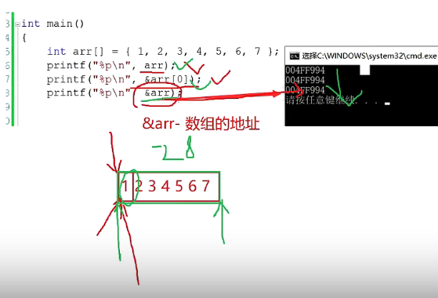
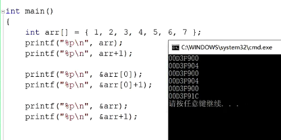

## 数组

### 一维数组的创建
- 数组是一组相同类型元素的集合。数组的创建方式：
- type_define arr_name [const_n]
  - type_t   是指数组中元素类型
  - const_n  是一个常量表达式，用来指定数组的大小
  - char a[10]; 内存中开辟 10 个连续的 char类型 字节空间
  - 例如：int n=10; int arr[n]= {0};该**定义方式不对**，因为n是arr中的n是变量不是常量

### 一维数组的初始化
- 不完全初始化，未初始化的元素默认为0；
- 字符类型在电脑中是以ASCII值存储的，b的ASCII为98，定义类型为char 时，写'b'或者98皆可；
- 未使用{},使用""包裹的字符数组初始化，在初始化元素的最后默认补'\0'
- 指定数组大小的常量在初始化时可以空着，但是定义时不行；
- int a[] = {1,2,3,4}; int *p = a; 
- 数组名 a 是首元素地址， int 类型，p是指向 int 类型的指针
  - 其实内存中对 a[2] 的操作是通过指针实现的
  - *(p+2) == *(a+2) == a[2]

### 二维数组及其初始化

- int a[2][3] = {1,2,3,4,5,6}; int a[2][3] = {{1,2,3},{4,5,6}};
  - 内存中存放形式：
    - | 1 | 2 | 3 | 4 | 5 | 6 |
  - 不是这样存放的：
    - | 1 | 2 | 3 |
    - | 4 | 5 | 6 |
- 二维数组数组名指向的是第一行一维数组的数组地址，必须使用**数组指针**来存放
  - void find(int** arr2); // err
    - 用来存放地址的 arr2 指针指向数组内部存放 int* 类型的元素
  - void find(int (*arr)[5]); 
    - arr 指针指向 int [5] 数组类型的数组，用来存放数组地址，符合二维数组的数组名传参
- 二维数组的列不能省略
- 如果使用{}分行的话，行与行之间的{}用,分开，每行都必须用{}包裹；
- 当前行元素个数小于定义的个数时，不足的部分用0补上；
- 二维数组在内存中同一维数组一样，也是**连续存放**
- 操作二维数组可以当作，arr[0][j]样式操作一维数组；


[指针大小的计算](../LibFunctions/LibFunction.md/#sizeofname)

```C

int a[3][4] = { 0 }; // 3行4列，a[0] a[1] a[2]

	printf("%d\n", sizeof(a)); // 3*4*4byte = 48byte, 数组中所有元素的大小
	printf("%d\n", sizeof(a[0][0])); // 4byte, 首元素大小
	printf("%d\n", sizeof(a[0]));  // 16byte 二维数组中，a[0]含义：第一行作为一维数组的数组名，且数组名是该行数组的首元素地址(类似一维数组)
	printf("%d\n", sizeof(a[0] + 1)); // 4byte, a[0][1]的地址
	printf("%d\n", sizeof(*(a[0] + 1))); // 4byte, a[0][1] 大小
	printf("%d\n", sizeof(a + 1));  // 4byte, 第二行数组地址 - sizeof(a+1)，内部有+1操作，非sizeof(a), 所以 a 是以第一行数组的首元素表示的第一行数组的数组地址 +1, 移动到第二行数组地址
	printf("%d\n", sizeof(*(a + 1))); // 16byte, 第二行数组名 - 第二行数组地址的解引用 sizeof(a[1])
	printf("%d\n", sizeof(&a[0] + 1)); // 4byte, 第二行的数组地址 - a[0]是第一行首元素表示的数组名，第一行数组的数组地址&a[0]， +1移动到第二行 
	printf("%d\n", sizeof(*(&a[0] + 1)));  // 16byte, 第二行的数组名 - *第二行的数组地址拿到数组名
	printf("%d\n", sizeof(*a));  // 16byte, 第一行的数组名 - sizeof(*a)，内部有*操作，非sizeof(a), 所以 a 是以第一行数组的首元素表示的第一行数组的数组地址
	printf("%d\n", sizeof(a[3])); // 16byte, 第四行数组名 - 虽然第四行不存在，但是sizeof计算的是以 a 为数组名的 int [4] 数组类型大小

```


```C

// 二维数组的数组指针应用

int main()
{
	int a[5][5];
	int(*p)[4];  // p的数据类型为：int(*)[4]
	p = a;   // 二维数组的数组名是以该行数组的首元素地址表示的第一行一维数组的数组地址，a的数据类型为：int (*) [5], 5是列,  p = a;语句会报警告，但是仍然会将 a 的第一行数组地址传给 p
	
  printf("%p,%d\n", &p[4][2] - &a[4][2], &p[4][2] - &a[4][2]); 
    // a 和 p 的数组地址 起始一致，p[4][2] == *(*(p+4)+2) *(p+4)拿到第5行的数组名，数组名即为首元素地址，+2 拿到当前行的第3个元素地址，最终解引用操作拿到5行3列的元素
                              // a[4][2] == *(*(a+4)+2) a+1 移动一个数组即 5 个int元素，p+1 移动一个数组即 4 个int元素

  // &p[4][2] - &a[4][2] == -4，1000 0000 0000 0000 0000 0000 0000 0100(原) - 1111 1111 1111 1111 1111 1111 1111 1011(反) - 1111 1111 1111 1111 1111 1111 1111 1100(补)
	// %d 打印时：-4 -> 原码 -> 反码 -> 补码(内存中值)，%d 打印是以原码形式输出 结果为 -4;
  // %p 打印时：地址与地址的 + - 运算是以字节位单位的，地址无符号, 无原码、反码、补码, 直接与内存中的计算结果相关，内存的值都为补码，所以&p[4][2]地址 - &a[4][2]地址, 结果为-4的补码：0xfffffffc
  
  return 0;
}

```

### 指针数组
- 本质是数组，用来存放指针
- 类似int\* 整形指针; char\* 字符指针，定义及初始化：int* arr[3] = {&a,&b,&c} 即为int 型指针数组，存放一类指针的集合
- int* arr[10]; arr[10] 数组中元素的自身类型为 int* 指针，则存放的是int 类型地址；指针指向类型为 int;

### 字符数组与指针

- 定义方式：
  - char arr[] = "a string";
  - char arr1[] = { 'a',' ','s','t','r','i','n','g', '\0' };
  - char str[][5] = { "R2D2" , "C3PO" , "R2A6" };
    - str[0] 第一行数组名，表示 二维数组第一行 "R2D2"
    - str[1] 第二行数组名，表示 二维数组第二行 "C3PO"
    - str[2] 第三行数组名，表示 二维数组第三行 "R2A6"
- 数组的修改：
  - arr数组必须使用系统函数strcpy(),包含在string.h头文件中
  - arr1数组可以同其他数组一样，使用下标赋值操作进行修改值的大小

```C
对于字符数组：
  char a[15] = “abcdef”; //初始化

但不能做如下操作

  char a[15]; //定义

  a[15] = “abcdef”; //赋值方式，但使用方法不对
```

- **特别注意**：第一种初始化的方式，看似左值是个字符串，其实不然，它其实是个初始化列表。最后列表包含 \0
- 字符数组是**不接受**将字符串直接**赋值**给它，数组内容是初始化来的
- 如果想操作字符串数组，可以使用字符串相关函数

[字符指针](../Pointer/pointer.md/#字符指针)

- 定义 char* pa = "abcdef";

```C

int main()
{
    char *a = "abcdef";
    printf("%d\n",sizeof(a));        // 4byte a 是地址
    printf("%d\n",sizeof(a+0));      // 4byte 仍是地址
    printf("%d\n",sizeof(*a));       // *a 是 a, 类型是 char，大小为 1byte
    printf("%d\n",sizeof(a+1));      // 4byte b的地址 
    printf("%d\n",sizeof(a[0]));     // 1byte a[0] == *(a+0) == 'a'
    printf("%d\n",sizeof(&a));       // 指针的地址仍是地址 4byte
    printf("%d\n",sizeof(*&a));      // *&a == a, a是一个地址，4byte
    printf("%d\n",sizeof(&a+1));     // 4byte
    printf("%d\n",sizeof(&a[0]));    // 4byte
    printf("%d\n",sizeof(&a[0]+1));  // 指向b的地址，4byte

    return 0;
}

```

### 数组的赋值问题
- [参见scanf函数](../LibFunctions/LibFunction.md/#scanf"10s"name)


### 数组作为函数参数

- 对数组 arr 进行传参，实际上传递过去的是数组 arr 首元素的地址 &arr[0]
```C

//////////////////////////
//////// 数组传参 /////////
///////////////////////////

// 数组
void sort(int arr[]);
void sort(int arr[10]);
void sort(int* arr); //第三种，int* arr, arr是一个指针用来存放 int 地址的, 区别于其他非数组的地址( sort(&a) )，为了函数能理解是数组，需要传入数组大小

//以上三个sort 函数中，形参数组只是定义形式不同，含义相同，前两个数组形式的参数，数组大小可以不写，可以写错(一般不建议)，都同第三种定义形式，是一个指针接受实参传递的地址

// 指针数组
void test(int* arr[10]);
void test(int* *arr);// int* 指向数组内部元素类型；*arr 说明arr是指针，用来存放地址的，数组名就是首元素地址；用来存放地址的 arr 指针指向数组内部存放 int* 地址的元素

// 二维数组
void find(int arr2[10][5]); // 最标准 易用的形式
void find(int arr2[][5]); // 不能省略二维数组的列，行可以省略
void find(int arr2[][]); // err, 列 不能省略
void find(int* arr2); // err  // arr2 指针指向 存放的是int 地址；

// 二维数组数组名指向的是第一行一维数组的数组地址，必须使用数组指针来存放
void find(int** arr2); // err, 用来存放地址的 arr2 指针指向数组内部存放 int* 类型的元素
void find(int (*arr)[5]); // arr 指针指向 int [5] 数组类型的数组，用来存放数组地址，符合二维数组的数组名传参


int main()
{
  int a = 0;
  int arr[10] ={0};
  int* arr1[10] = {0}; // arr1 是指针数组，数组中存放的是int* 地址
  int arr2[10][5] = {0};  

  sort(&a); //对应的形参是 int* arr, 同数组的形参一致，不过函数为了区分是数组的话也会同数组名一起传递数组大小
  sort(arr);
  test(arr1);
  find(arr2);

}

```
- 在函数中直接使用某些函数时可能产生错误，如sizeof(arr), sizeof函数直接调用形参接受的地址
  - 

### 数组名是什么
- 一维数组的数组名是首元素地址, 32bit系统，4byte, 64bit - 8byte
- 有两个例外不是首元素地址
  - sizeof(arr)，arr表示整个数组，计算的是整个数组（数组中所有元素的集合）存储空间的大小，单位字节，不是地址的大小；
  - &arr，arr表示整个数组，取出的是整个数组的地址
    - 虽然arr &arr[0] &arr 内存地址相同，但是&arr取出的是整个数组的起始地址，&arr+1表示的是数组中最后一个元素后一个元素的地址，如下图
  - 除了以上两种情况以外，所有的数组名都表示数组首元素的地址；
  
    

    

- 二维数组的数组名 arr 是 第一行 一维数组 的地址，但是是用第一行 一维数组 首元素的地址表示的
- 两个例外：
  - &arr 二维数组的数组地址，&arr+1 表示跳过整个数组，到数组中最后一个元素后一个元素的地址
  - sizeof(arr)，arr 表示整个数组，计算的是整个数组（数组中所有元素的集合）存储空间的大小，单位字节，不是地址的大小；

[使用sizeof计算数组名作为形参](../LibFunctions/LibFunction.md/#示例代码)


### 指针与数组的关系

```C
int a[4] = {1,2,3,4};
int* ptr = (int*)((int)a+1) 

printf("%x",ptr[-1]);
// ptr[-1] == *(ptr+(-1))


```


### 变长数组


- c99 标准下 可以支持 数组长度的改变，c90 标准下 数组长度在定义时必须是一个常量，不接受变量
- 局限性：当前很多编译器不支持 c99 标准
- gcc 编译器 调用 c99标准 命令：
  - gcc text.c -std=c99
