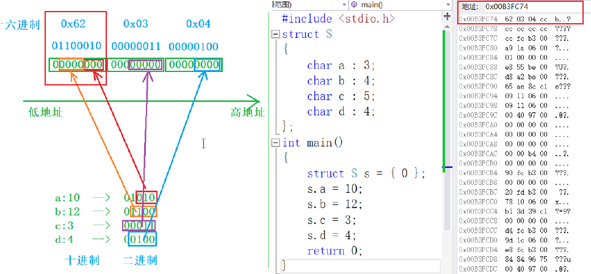

## 位段(位域)

### 位域的定义
- 位域的定义类似结构体变量，但是结构体成员形式不同
- 位域成员 必须是关键字 signed 或者 unsigned 修饰的整型(char short int)
- 位域成员的定义形式：整型 成员名:bit位数

```C

struct A
{
    char a:3;
    char b:4;
    int c:2;
    unsigned int d:5
    short e:4;
    int f:30;
    //int g:33; // bit位数不允许超过 32位
    
}

int main()
{
    struct A a = {0};
    s.a = 10; // a == 1010B, a 是 3bit, 截断后存储为 010
    s.b = 12; // b == 1100B, b 是 4bit, 截断后存储为 1100

}

```

### 内存分配规则

- 位段的空间上是按照需要以 4 个字节（ int ）或者1个字节（ char ）的方式来开辟的
  - 如 struct A 的定义：
  - char a:3; 首先开辟 1byte 8bit, a使用3bit
  - char b:4; 上次开辟的 1byte 剩余 5bit, b 使用 4bit, 剩余 1bit;
  - int c:2; c 需要使用 2bit, 但是第一次开辟的 1byte 空间剩余 1bit 不足 c 使用，所以需要根据int 类型另外开辟 4byte 空间来存放 c, 浪费掉上个空间的 1bit，浪费的位值置 0；
- 位段涉及很多不确定因素，位段是不跨平台的，注重可移植的程序应该避免使用位段
  - 以上定义的位成员 a 使用的 3bit 在1byte 中是如何选择的呢？不同平台的使用顺序不同
  - 假如在 1byte 中是从低位开始选择的，a 属于 0-2bit；b 属于 3-6bit; 7bit 浪费掉置0；该字节在内存中的二进制形式为：01100010 == 0x62


 


### 位域的跨平台限制
- int 位段被当成有符号数还是无符号数是不确定的
- 位段中最大位的数目不能确定。（16位机器最大16，32位机器最大32，写成27，在16位机器会出问题）
- 位段中的成员在内存中从左向右分配，还是从右向左分配标准尚未定义
- 当一个结构包含两个位段，第二个位段成员比较大，无法容纳于第一个位段剩余的位时，是舍弃剩余的位还是利用，这是不确定的