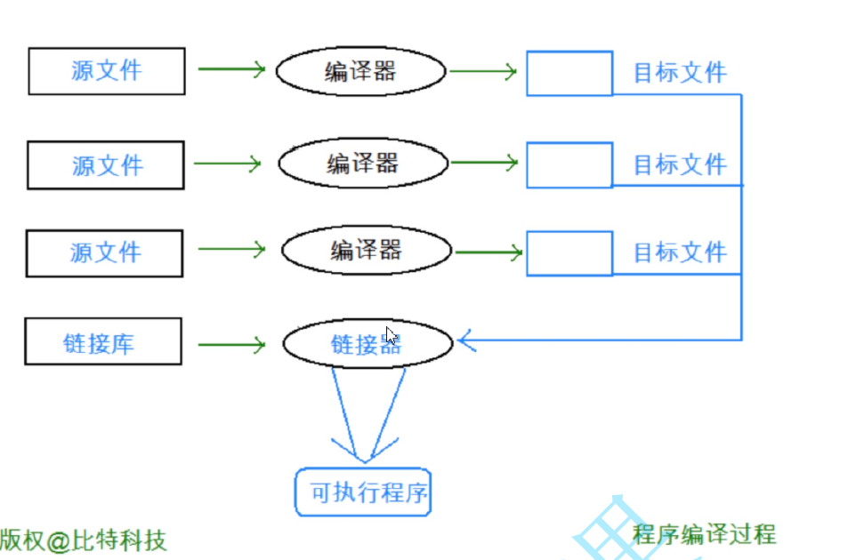

## 编译原理[^1]


### 编译中间文件后缀格式
```shell

*.c  　——C源文件
*.i  　——经过预处理后的C源文件
*.s  　——不需要预处理编译后的汇编文件
*.S  　——需要预处理编译后的汇编文件
*.o　  ——由汇编代码转换成的计算机可认识的二进制obj文件
*.h  　——C头文件
*.ii  　——经过预处理后的C++源文件
*.cc　　——C++源文件
*.cxx  ——C++源文件
*.cpp  ——C++源文件
*.C  　——C++源文件

```

### 命令格式

> ```shell
> gcc [options] file…
> ```
>
> 在命令 gcc 后面跟一个或多个选项，选项间用空格隔开，然后跟一个或多个目标文件

### 输出控制选项

> -E    　　　　仅仅运行C的预处理器，不编译，不汇编，不链接
>
> -S                   只对 预处理文件进行**编译**，不汇编，不链接
>
> -c　　　　    对汇编文件进行**编译**和**汇编**，不链接
>
> -o file             将输出内容存于文件file
>
> -v　　　　　打印出编译过程中执行的命令
>
> -x language　说明文件的输入类型为哪种语言 C C++
>
> -pipe   　　　在编译的不同阶段之间采用管道通讯方式


### GNU GCC 的基本功能

- 编译器：最终生成 .obj 或者 .o文件
  - 预编译 (Preprocessing)
  - 编译 (Compilation)
  - 汇编 (Assembly) 

- 链接 (Linking/Build)

- 程序运行




- 实际上 gcc 命令只是后台 预编译程序 cpp、编译程序 cc1、汇编器as、链接器 ld 的包装，它会根据不同的参数要求去调用cpp、cc1、as、ld。


### 预编译 (Preprocessing)
- gcc 命令 是编译的前端程序，它通过调用其他程序来实现将程序源文件编译成目标文件的功能

- 预编译：文本操作
  - 首先调用**预处理程序 cpp **对输入的源程序进行处理，处理各种预处理指令（#include、#define、#ifdef 等 #开始的代码行），删除注释和多余的空白字符，生成一份新的代码
  - 如展开头文件，对 #include 包含的头文件内容做一个简单的替换，替换到.c 文件里面去
  - 把代码中的注释去掉
  - 替换 #define 定义的宏
  - 最终输出预处理后的 C/C++ 源程序


#### 操作指令

> 将 hello.c 源文件使用预处理器处理后的源程序输出内容存到文件 hello.i
>
> ```shell
> gcc -E hello.c -o hello.i
> // 或者
> gcc -E hello.c > hello.i
> ```
>
> gcc 对目标文件 hello.c 运行 C 的预处理(-E)
>
> 注意：-o 作用是指定输出文件的名字，如果不加 - o hello.i 的话，结果将会打印在屏幕上


### 编译 (Compilation)

- gcc 命令 调用**cc1 编译程序**对预处理后的源程序代码进行语法、词法、语义分析、**符号汇总**（函数名、全局变量等）和错误判断，输出 C/C++ 源程序的汇编代码，格式为 .s

#### 操作指令
> ```shell
> gcc -S hello.i -o hello.s
> // 或者
> // gcc -S hello.i
> ```
>
> gcc 对目标文件 hello.i 进行编译(-S)，生成汇编文件输出内容到 hello.s 文件，不加 -o指令也可，.s 后缀的文件不需要再次预处理了

### 汇编 (Assembly) 

- 把汇编代码转换成计算机可认识的二进制 .o(linux)/.obj(win) 文件输出
  - 调用 **as 汇编器程序**，将汇编语言程序 .s 文件转换为 ELF (Executable and Linking Format，执行时链接文件格式) 格式的可重定位的 .o 目标代码，令目标代码同其它目标模块或函数库易于定位和链接
  - as 汇编器程序产生一个交叉参考表和一个标准的符号表，产生的代码和数据能够放在多个区 (Section) 中
- 可以通过以下方法将二进制文件 hello.o 转化为我们可读的形式
  - ```shell
    readelf -a hello.o
    ```

#### 操作指令
> ```shell
> gcc -c hello.s -o hello.o
> ```
>
> gcc 对目标文件 hello.s 执行指令转换（-c），生成汇编文件输出内容到 hello.s 文件


### 链接 (Linking/Build)

通俗的讲就是把一个或多个 *.o 二进制指令文件同源文件中调用的标准库函数 和 开发者引用的个人库合并成一个可执行文件
- 合并段表
  - **ld 链接器程序** 根据链接定位文件 Linkcmds 中的代码区、数据区、BSS 区和栈区等定位信息，将可重定位的目标模块链接成一个单一的、绝对定位的目标程序
  - 该目标程序是 ELF 格式，并且可以包含调试信息

- 符合表的合并和重定向
  - ld 链接器程序会产生一个内存映象文件 Map.txt, 该文件显示所有目标模块、区和符号的绝对定位地址。它也产生交叉参考列表，显示参考每个全局符号的目标模块。

- ld 支持将多个目标模块链接成一个单一的、绝对定位的目标程序，也能够依此对目标模块进行链接，这个特性称为增量链接 (Incremental Linking)。

- 假如输入文件是一个函数库，ld 会自动从函数库装载被其它目标模块参考的函数模块。ld 与其它链接程序相比，能提供更有帮助的诊断信息。许多链接器遇到第一个错误即放弃链接，而 ld 只要有可能都继续执行，帮助用户识别其它错误，有时甚至能获得输出代码

- 可以对合并成的可执行目标程序文件进行**二进制指令转汇编**操作
  - objdump -d hello

#### 操作指令

> ```shell
> gcc -o hello hello.o
> ```
>
> 注意：gcc  **没有单独的链接参数**，这里 -o 生成内容存储到 hello 文件的过程不能省略 -o 操作。因为 系统库函数、开发者引入的库函数同 hello.o 二进制文件进行链接，得到可执行的程序 hello。


### 程序运行

- 程序运行首先会**加载到内存**中，这个过程 有操作系统的会由系统加载完成，没有操作系统的，在独立的环境中时，程序载入内存则由手工完成

- ./ 当前文件夹，否则系统到系统源文件中查找
- ./hello 即可执行最终生成的可执行文件

- 程序的执行首先是从 main 函数开始的，也终止于 main 函数，也有可能是以外终止

- 如果想知道在 linux 系统下链接来了什么库（即可执行程序需要用到什么库），使用命令 ldd hello 查看


### 生成静态库

- ar 库管理程序 将多个可重定位的目标模块归档为一个函数库文件。采用函数库文件，应用程序能够从该文件中自动装载要参考的函数模块，同时将应用程序中频繁调用的函数放入函数库文件中，易于应用程序的开发管理。ar 支持 ELF 格式的函数库文件
- 编译静态库，后缀为 .a
  - ar rcs libxx.a  fun.c


- 生成可执行程序
- 转换文件格式


[^1]: 参考书籍《程序员的自我修养》
