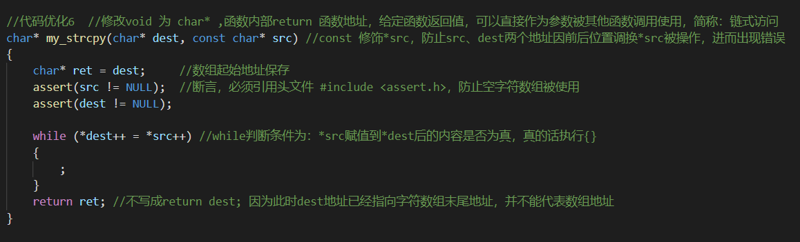

### 调试快捷键的使用

- F9 设置断点与取消断点，配合F5可以使程序在想要的位置停止，进而一步步执行下去；在断点处右击可以设置判断条件，满足断点条件后在该位置停止；
- F5 启动调试，如果有设置断点的话，执行完断点前程序并停在断点处，再次按下F5时，将会在程序逻辑上执行下一步，非物理上下一步；
- ctrl+F5, 开始执行程序不调试；
- F10 step over, 逐过程，通常用来处理一个过程，一个过程可以是一次函数调用，或者是一条语句;
- F11 逐语句，就是每次都执行一条语句，但是这个快捷键可以使我们的执行逻辑进入函数内部（这是最长用的）
- F10 F11 F5，不使用F9设置断点也可以直接使用,断点是为了针对个别语句调试方便；

### 调试展示窗口

- call stack(调用堆栈)：展示函数的调用逻辑。main()函数逻辑运行中依次调用的外部函数，然后再次回到main()函数寻找什么函数中定义的main()函数可被当前main()函数使用；
- memory 内存：查看定义变量的存储区中 地址与存储值内容；
- watch 监视：监视变量在程序运行中值的变化；

### Debug和Release的介绍
- Debug 通常称为调试版本，它包含调试信息，并且不作任何优化，便于程序员调试程序。
- Release 称为发布版本，它往往是进行了各种优化，使得程序在代码大小和运行速度上都是最优的，以便用户很好地使用
- Relese 优化的方式有哪些：
  - 调节变量前后位置
  - 存储位置的更改

### 如何写出好、易于调试的代码
- 代码运行正常
- bug 很少
- 效率高
- 可读性高
- 可维护性高
- 注释清晰
- 文档齐全

### 常见的coding技巧
- 使用assert
- 尽量使用const
- 养成良好的编码风格
- 添加必要的注释
- 避免编码的陷阱

### 一些特殊案例
- [程序死循环或者数组越界访问](../SpecialCase/case.md/#程序死循环)