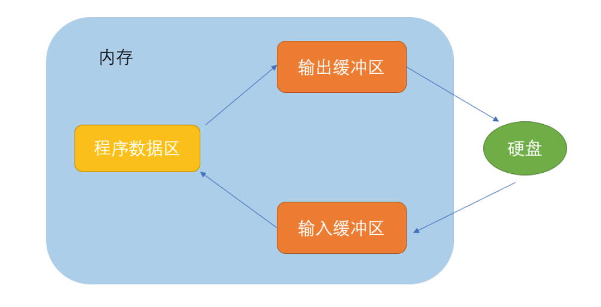
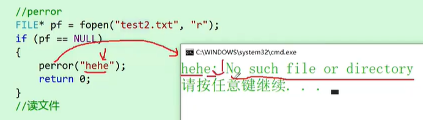

## 文件操作

### 操作过程

```C

#include <stdio.h>

int main()
{
    int a = 10000;
    // FILE 是一个结构体类型，用来存放文件的名称 大小 类型 等，
    // 这些信息都是通过FILE 结构体指针来维护的，程序读取、写入文件时，文件的信息存放在输入 输出缓冲区内部
    FILE *pf = fopen("test.txt","wb"); // 创建结构体指针存放打开文件的地址，"wb" 写一个二进制文件

    // pf 是打开文件后形成的一个指向文件信息的的结构体指针，一般说是一个流
    if(NULL == pf)
    {
        printf("%s\n",strerror(errno));
        
        return 0;

    }

    fwrite(&a,sizeof(a),1,pf); // 二进制写操作,将 a 这样大小的数据 一个放到流 pf 中，返回 a 元素
    fclose(pf);
    pf = NULL;

    return 0;
}

```

- ```c
  FILE *fopen (const char *filename, const char *modes)
  ```
  
  - filename 可以是绝对路径 或者 相对路径 的文件名
    - "c:\files\test.txt", 其中\test 的 \t 是tab 缩进的功能，可以使用多一个 \ 强制转换，"c:\\\files\\\test.txt"
  - modes: 以下表格


|  | modes 可供选择的模式（注意：" " 不是 ' '） | |
|---:|---:|---:|
| 文件使用方式 | 含义 |如果指定文件不存在|
|“r”（只读）| 为了输入数据，打开一个已经存在的文本文件 | 出错，返回一个 FILE类型指针 NULL|
|“w”（只写） | 为了输出数据，打开一个文本文件 | 建立一个新的文件，覆盖已存在的同名文件|
|“a”（追加）| 向文本文件尾添加数据 | 建立一个新的文件|
|“wb”（只写） | 为了向流中输入数据，打开一个已经存在的二进制文件流 | 建立一个新的文件，覆盖已存在的同名文件|
|“rb”（只读） | 为了从流中输出数据，打开一个已经存在的二进制文件流 | 出错，返回一个 FILE类型指针 NULL|
|“r+”（读写） | 为了读和写，打开一个文本文件 | 出错 |
|“w+”（读写）| 为了读和写，新建一个文本文件 | 建立一个新的文件，覆盖已存在的同名文件 |




- FILE 是一个结构体类型，用来存放文件的名称 大小 类型 等，这些信息都是通过FILE 结构体指针来维护的，程序读取、写入文件时，文件的信息存放在输入 输出缓冲区内部
- FILE 定义的 指针变量 接收的是一个打开的流
- stderr:  标准错误流
- 键盘 - 标准输入设备，默认输入流： stdin
- 显示器 - 标准输出设备，默认的输出流: stdout
  ```C
  
  int ch = fgetc(stdin);
  fputc(ch,stdout);
  
  // 标准错误流 stderr
  fprintf(stderr, "connect ok!!\n");
  
  ```

### 文件的顺序读写

- 注意：函数读写后，打印时是否有换行

| |文件的顺序读写 | |
|---:|---:|---:|
|功能 | 函数名 | 适用于 |
|从流中读字符 函数 | fgetc | 所有输入流 |
|字符写入到流 函数 | fputc | 所有输出流 |
|从流中读取文本，碰到换行符停止读取，存储到指定的内存块中，并在结尾附加一个null | fgets | 所有输入流 |
|文本行写入到流 函数 | fputs | 所有输出流 |
|从流中读取格式化内容 函数 | fscanf | 所有输入流 |
|写入（打印）格式化内容到流 函数 | fprintf | 所有输出流 |
|从流中读取二进制文件，返回成功读取元素的个数 | fread | 文件 |
|写入二进制文件到流中 | fwrite | 文件 |

### 对比一组函数


- scanf fsanf sscanf
	- fscanf 函数第一个参数类型是 流，其他参数同scanf
	
	- sscanf 从一个字符串中读进与指定格式相符的数据
	
	- scanf 以键盘（stdin）为输入源，sscanf 以固定字符串为输入源
	
	  - ```c
	    int sscanf(const char *__source, const char *__format, ...)
	    ```
	
- printf fprintf sprintf
	- fprintf 函数第一个参数类型是 流， 其他参数同 printf
	
	- sprintf 函数功能 打印到字符串中，而printf函数打印输出到屏幕上。
	
	- sprintf 函数用在完成其他数据类型转换成字符串类型的操作中
	
	  - ```C
	    int sprintf (char *__stream, const char *__format, ...)
	    ```

### 文件的随机读写

```c
int fseek ( FILE * stream, long int offset, int origin );
// long int offset: 偏移量，可以为负
// int oringin: 指针的当前位置, 三个特殊量可设置
	// SEEK_CUR 文件的当前位置
	// SEEK_END 文件的末尾位置
	// SEEK_SET 文件的起始位置
// e.g fseek(pf, -2, SEEK_END) // 文件末端位置向前偏移2
```

- 根据文件指针的位置和偏移量来定位文件指针


```c
long int ftell ( FILE * stream );
```

- 返回文件指针相对于起始位置的偏移量


```c
void rewind(FILE *stream);
```

- 让文件指针的位置回到文件的起始位置


```C
/* ftell example : getting size of a file */
#include <stdio.h>
int main ()
{
    FILE * pFile;
    long size;
    pFile = fopen ("myfile.txt","rb");
    
    if (pFile==NULL) 
        perror ("Error opening file");
    else
    {
        fseek (pFile, 0, SEEK_END);
        size=ftell (pFile);
        fclose (pFile);
        printf ("Size of myfile.txt: %ld bytes.\n",size);
    }
    
    return 0;
}
```


```C
int feof(FILE *_File);
```

- EOF - end of file, 文件结束标志，读取为空文件时为 EOF 值为 -1
- 功能：检查**是否设置**了与流关联的**文件结束指示符**，如果设置，则返回一个不同于零的值
  - **如何设置？**一般是上级操作中产生的，比如使用 fgetc(pFile) 读取到 pFile 流文件末尾，已经完成读取，此时就会设置 pFile 流文件的文件结束指示符

- **牢记**：在文件读取过程中，**不能**直接用 feof() 函数的返回值直接用来判断文件的是否结束，因为除了遇到文件尾结束的，还有读取错误结束的
- 而是**应用于当文件读取结束**的时候，判断是读取失败结束，还是遇到文件尾结束
  - **文本文件**的读取是否结束，判断返回值是否为 fgetc 函数的 EOF，或者 fgets 函数的 NULL

```C
int c = 0; // 注意：要求处理EOF, 必须是 int，非char

// fgetc 函数当读取失败的时候 或者 遇到文件结束的时候，都会返回EOF
while (fgetc(pFile) != EOF) // while(fgets(pFile) != NULL)
{  
    putchar(c);
}

// 判断结束原因
if (feof(pFile))
{
    puts ("End-of-File reached."); 
}
else if(ferror(pFile)) // while 循环完毕，自动设置了与流关联的错误指示符，ferror函数返回一个不为 0 的整型值
{
    puts("I/O error when reading"); // 读取错误
}
    
fclose (pFile);
pFile = NULL;

```

​		

 -  **二进制文件**的读取结束判断，判断返回值是否小于实际要读的个数

```C
while(fread(&c, sizeof(int), 1, pf) >= 1)// 会触发流文件 错误指示符 结束指示符的设置
{
    // 读取成功后操作
}
if (feof(pf)) //feof 函数检测到流文件设置的 文件结束指示符，返回值是不为 0 的整型值
{
    puts("end of file reached.");
}
else if(ferror(pFile)) // 检测到 流文件设置的 错误指示符，返回值是不为 0 的整型值
{
    printf("I/O error when reading"); // 读取错误
}
fclose(pFile);
pFile = NULL;
```


### 对比三个错误判断函数

- ```C
  int ferror(FILE *_File);
  ```

  - 检查是否设置了与流关联的错误指示符，如果设置了则返回一个不同于零的值

  - ```c
    #include <stdio.h>
    int main ()
    {
      FILE * pFile;
      pFile=fopen("myfile.txt","r");
      
      if (pFile==NULL) 
          perror ("Error opening file");
      else 
      {
        fputc ('x',pFile); // 如果 pFile 文件流写入失败的话，会设置与流关联的错误指示符，设置后返回值是一个不同于零的值
        if (ferror (pFile))
            printf ("Error Writing to myfile.txt\n");
        else if(feof(pFile))
            printf("End-of-File reached.");
          
        fclose (pFile);
        pFile = NULL;
      }
        
      return 0;
    }
    ```
  
  
  
- strerror(errno) - 把错误码对应的错误信息的字符串地址返回，一般使用方法

  - ```C
    printf("%s",strerror(errno));
    ```

  

- ```c
  perror ("Error opening file");
  ```

  - ```C
    perror ("hehe"); 
    // 功能：打印出设置的提示信息，并且加上：strerror(errno)的报错信息
    // 比如以下示例：假如test2.txt 文件不存在时，perror 函数将打印 hehe: No such file or directory
    ```

    
