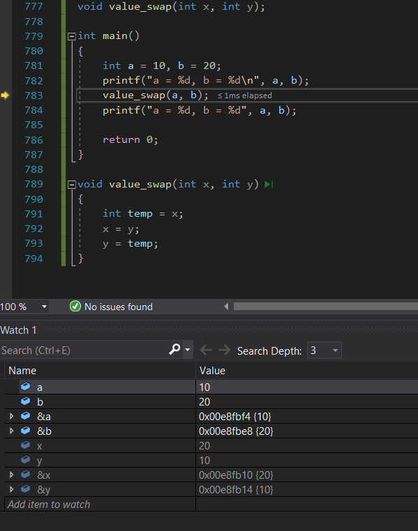

## 函数的声明和定义

### 函数的声明
- 在函数声明中，参数的名称list并不重要，只有参数的类型parameter是必需的；
- 函数声明结构: return_type function_name( parameter1,* );
- 函数的声明一般出现在函数的使用之前。既满足先声明后使用
- 函数的定义是指函数的具体实现，交待函数的一个功能实现
- 函数的声明和定义可以一起设置，也可以先声明，用";"结束，函数定义没有";"
```C
//函数定义：区别函数声明

return_type function_name( define_type parameter1,* )
{
    statement; //语句项
}

//return_type 返回类型
//function_name 函数名
//define_type 定义类型
//parameter1 函数形式参数1，在函数体中-语句项 中可以直接使用
```
- 工程项目时，函数声明一般放在头文件(.h)中，包含在 main主函数中
- 功能函数单独一个.c文件同main函数放在一起，都位于source文件夹
- C语言自带头文件使用<>包裹；
- 自建头文件使用""包裹；

## 函数的调用
- 示例
- 
- 调用的函数value_swap中x,y值发生了改变，但是main主函数中a,b值未发生改变，
- 可以看到main主函数中a值传给x,b值传给y,但是在调用的value_swap函数中只是起到赋值作用并没有操作a,b,
- 因为地址是唯一的，可以传递地址给value_swap函数


### 传值调用
函数的形参和实参分别占有不同内存块对形参的修改不会影响实参

### 传址调用
- 传址调用是把函数外部创建变量的内存地址传递给函数参数的一种调用函数的方式
- 这种传参方式可以让函数和函数外边的变量建立起正真的联系，也就是函数内部可以直接操作函数外部的变量