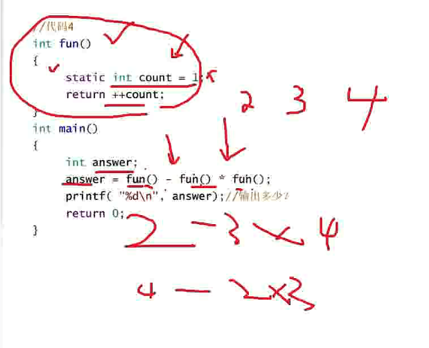

## 运算符 / 操作符

### 为题汇总 ？？？
- 整形提升/隐式转换

### 自增和自减运算符 (-- 和 ++)
- 作用是使变量的值增 1 或减 1
- ++i ：在使用 i 之前，先使 i 的值加 1，如果 i 的原值为 3，则执行 j=++i 后，j 的值为 4
- --i ：在使用 i 之前，先使 i 的值减 1，如果 i 的原值为 3，则执行 j=--i 后，j 的值为 2
- i++ ：在使用 i 之后，使 i 的值加 1，如果 i 的原值为 3，则执行 j=i++ 后，j 的值为 3，然后 i 变为 4
- i-- ：在使用 i 之后，使 i 的值减 1，如果 i 的原值为 3，则执行 j=i-- 后，j 的值为 3，然后 i 变为 2
- ++i 是先执行 i=i+1 后，再使用 i 的值；而 i++ 是先使用 i 的值后，再执行 i=i+1

### sizeof(name)
- 计算变量、数组、类型的大小，单位是字节；
- 当 name int 型 (4B) 数组, 两个元素时，计算所占空间大小为 4*2=8B;
- 当 name char 型 (1B) 数组, 使用 ""包裹 3 个字符时，所占空间大小为 4*1=4，包括所有未显示的部分末尾处'\0'；

### * 解引用操作符号 / 取值运算符 / 间接运算符
- *p 表示，通过 \* 操作拿到 p 指针内部存放地址指向的值

### & 地址运算符
- 取得变量的存储地址；
- %p 打印输出时，地址的说明符

### const 修饰符
- 修饰指针变量
  - const 放在指针变量的 \* ** 左边 ** 时，如：const int\* p = &a; 修饰的是 \*p，也就是说：不能通过 p 来改变 \*p(就是 num) 的值，但是 p 的值可以修改；
  - const 放在指针变量的 \* ** 右边 ** 时，如：int\* const p = &a; 修饰的是指针变量 p 本身，p 不能被改变；
  - const 放在指针变量的 \* ** 左边 ** 也放在 ** 右边 ** 时，如：const int\* const p = &a; 修饰 *p 和 指针 p 两个量，都不能被改变；


### exp1 ? exp2 : exp3 条件操作符（三目操作符）
- exp1 成立，计算 exp2，整个三目表达式返回结果是：exp2 的结果；
- exp1 不成立，计算 exp3，整个三目表达式返回结果是：exp3 的结果；
```C

int main()
{
	int a = 1, b = 2;
	int max = a < b ? ++b : a; //3
	printf("%d\n", max);

	return 0;
}
```

### 位 (bite) 操作符，操作数只能是整数
- 移位操作符
  - 操作数只能是整数, 对二进制位进行移动
  - 操作数为正整数的话为原码，负数则为补码
  - 不要移动负数位，这个是标准未定义的，如：num>>-1;
  - << 左移
    - 左边抛弃， 右边补 0
    - 作用：左移一位 有十进制中 *2 的效果
  - \>\> 右移
    - 算术移位：左边用操作数的符号位填充，右边丢弃
    - 逻辑移位：左边用 0 填充，右边丢弃
    - 如何确定算术移位与逻辑移位
    ```C
    int a = -1;
    int b = a>>1;
    printf("%d",b); // 输出结果为 - 1，带有符号位 所以为算术移位

    ////////////////////////////////
    ////一个数的二进制中有多少个1/////
    ////////////////////////////////
    // 方法1
    int get_num_one(int n, int sz)
    {
        int count = 0;
        for(int i = 0; i < sz; i++)
        {
            if (1 == ((n>>i) & 1))
            {
                count++;
            }
        }
        
        return count;
    }

    // n = 13, 1101
    // n&(n-1)
    // n   1101
    // n-1 1100
    // n   1100
    // n-1 1011
    // n   1000
    // n-1 0111
    // n   0000
    // 方法2 最优法
    int get_num_one(int n)
    {
        int count = 0;
        while(n) // n不为0
        {
          n = n&(n-1);
          count++;
        }

        return count;
    }

    // 方法3
    int get_num_one(unsigned int a)
    {
        int count = 0;
        while (a)
        {
            if (1 == a % 2)
            {
                count++;
            }
            a = a / 2; //当a < 2，对2取整为0，此刻可以截止
        }
       
        return count;
    }

    int main()
    {
        int n = 0;
        int a = 0;
        scanf("%d", &a);

        n = get_num_one(a);
        printf("count = %d", n);

        return 0;
    }

    ```
- & 按位与
- | 按位或
- ^ [按位异或](./../SpecialCase/case.md/#二进制-位异或)
- ~ 对一个数二进制按位取反，不顾及正数、负数，反码、补码等
```C
// 所以，当
char a = 0;  // 00000000000000000000000000000000
char b = ~a; // 11111111111111111111111111111111(补)
             // 11111111111111111111111111111110(反)
             // 10000000000000000000000000000001(原) -1
printf("%d",b); //输出b为 -1

// a = 0；为正数，即 a=0x00 原码，反码，补码 三码相同；
// b = ~a; 对a的补码进行位取反即为b的补码 b=0xff, 且存储在内存中，
// b=0xff，最高位为 1 值为负，那么补码 b 的反码为：0xfe，最高位符号位不变，反码 = 补码 - 1, 
// 反码最高位 1 保持不变，其他位取反得到原码 0x81 = 10000001, 十进制为 -1
// 
```

### 逗号表达式
- 逗号表达式，就是用逗号隔开的多个表达式
- 整个表达式的结果是最后一个表达式返回的结果
- 最后一个表达式逗号之前的表达式也会执行，整个表达式的执行顺序是从左向右依次执行
- 虽然整个表达式的结果是最后一个表达式的结果，但是最后一个表达式逗号之前的表达式运算的变量会参与最后一个表达式的运算

```C
int a = 1;
int b = 2;
int c = (a>b, a=b+10, a, b=a+1); //逗号表达式, a>b没有输出结果，a 没有参与运算，从c = b = a +1 = b+10+1 = 13

if (a =b + 1, c=a / 2, d > 0) //起到判断作用的是d>0, 但是d>0 之前的表达式也需要依次计算

int a[3][2] = { (0, 1), (2, 3), (4, 5) }; // (0,1)是逗号表达式结果是1，所以数组 a 初始化 int a[3][2] = {1,3,5}, 内存中是int a[3][2] = {{1,3},{5,0},{0,0}}

```

### 算术操作符
- \+ - * /
- % 算术取余运算， / 算术取商运算，% 运算符 ** 只能操作整形数据 **，不能操作浮点数
```C
int a = 5/2;
printf("%d", a); // 商 2 余 1
double b = 5/2.0;
printf("%lf",b); //2.5 浮点数

```

### 整形提升/隐式转换
> A character, a short integer, or an integer bit-field, all either signed or not, or an object of enumeration type, may be used in an expression wherever an integer maybe used. If an int can represent all the values of the original type, then the value is converted to int; otherwise the value is converted to unsigned int.
> 
> 翻译：
> 无论使用什么整数，都可以在表达式中使用 char，short int 或 int 字段（全部带符号或没有符号）或枚举类型的对象。如果原始类型的所有值都可用 int 类型表示，则其值将被转换为 int 类型；否则将被转换为 unsigned int 类型

- 原始类型为 字符(char) 、短整型(short) 、有符号或者无符号等操作数只要在表达式中被使用，使用之前要被转换为普通整型(int)来参与计算的
- 按照变量的**数据类型**的**符号位**来提升的

```C
- 负数的整形提升
char c1 = -1;
/*
变量 c1 char 类型，在内存中存储的二进制位(补码)只有8个比特位：
11111111
因为 char 为有符号的 char
所以整形提升的时候，高位(从右往左，第九位之后的所有位)补充符号位(提升前值的符号位)的数字，即为1
提升之后的结果是：
111111111111111111111111|11111111（不包括 | ）
*/

- 正数的整形提升
char c2 = 1;
/*
变量c2的二进制位(补码)中只有8个比特位：
00000001
因为 char 为有符号的 char
所以整形提升的时候，高位(从右往左，第九位之后的所有位)补充符号位(提升前值的符号位)的数字，即为0
提升之后的结果是：
000000000000000000000000|00000001 （不包括 | ）
*/

- 无符号整形提升，高位补0

//实例 
int main()
{
	char a = 3; //3的二进制形式：00000000000000000000000000000011,因为 char 类型 8个字节 将对32位二进制进行截断存储 00000011(原码 = 补码)
	char b = 127;// 32位截断存储为 011111111(原码 = 补码)
	// a + b 运算前 整型提升 char -> int 
	// a 00000011 -> 00000000000000000000000000000011
	// b 01111111 -> 00000000000000000000000001111111
	//               00000000000000000000000010000010  a + b( 内存中int型运算 )
	// c = a + b, char c, 截断存储
	// c = 10000010
	char c = a + b; 

	printf("%d\n", c); // %d输出，c 发生整型提升, 看最高位符号位 符号
  // c = 10000010 char -> int 
	// c = 11111111111111111111111110000010 int (补)
	// c = 11111111111111111111111110000001 int (反)
	// c = 10000000000000000000000001111110 int (原) //-126

	return 0;
}

//实例1 ????
//a,b整形提升之后,变成了负数,所以表达式a==0xb6 , b==0xb600 的结果是假,但是c不发生整形提升,则表达式c==0xb6000000 的结果是真
int main()
{
  char a = 0xb6; // 内存中存放的是 0xb6, 没有十进制中最高位 符号位的注意，原码 反码 补码的运算
  short b = 0xb600;
  int c = 0xb6000000;
  if(a==0xb6)
    printf("a"); //不打印
  if(b==0xb600)
    printf("b"); //不打印
  if(c==0xb6000000)
    printf("c");  //打印

  return 0;
}

//实例2
int main()
{
  char c = 1;
  printf("%u\n", sizeof(c));  //1
  printf("%u\n", sizeof(+c)); //4
  printf("%u\n", sizeof(-c)); //4
  printf("%u\n", sizeof(!c)); //1 // 为什么!c没有参与整型提升 ？？？？？？？

  return 0;
}

//实例3
int main() 
{ 
  char a = 0xfb;  // 0xfb = 11111011 原，10000100 反，10000101补
  unsigned char b = 0xfb; // 无正负之分，不能赋值负数，不然会出现错误 ？？？

  printf("a = %c", a); 
  printf("\nb = %c", b); 

  if (a == b) // a 是 **有符号** char类型，内存中补码 符号位是1，为负值, 整型提升, 符号位之前的用 1 补齐；
    printf("\nSame"); 
  else
    printf("\nNot Same"); 

  system("pause");
  return 0; 
}

```

### 赋值操作符
- =      区分 == 判断相等符号
- +=
- -=
- *=
- /=
- &=
- ^=
- |=
- \>>=   区分大于等于 >=
- <<=    区分小于等于 <=

### 其他操作符
- % 算术取余运算
  -  / 算术取商运算，% 运算符 ** 只能操作整形数据 **，不能操作浮点数
- && 逻辑与 
  - i = a++ && ++b && d++; 从左往右依次运算，当a++为假或者a++为真，++b为假，只要碰到为假，后面的运算将不会进行
  - i = a++||++b||d++; 从左往右依次运算，a++真或者a++为假++b为真，只要碰到为真，后面的运算将不会进行
```C
//程序输出的结果是什么？
int main()
{
  int i = 0,a=0,b=2,c =3,d=4;
  i = a++ && ++b && d++; //a++ 为0，后面的运算将不会进行，printf, a b c d: 1 2 3 4
  //i = a++||++b||d++; //a++ 为0，++b 为3 真，后面的运算将不会进行，printf, a b c d: 1 3 3 4
  printf("a = %d\n b = %d\n c = %d\nd = %d\n", a, b, c, d);
  
  return 0;
}
```
- || 逻辑或
- ！ 逻辑非，区别与 ~ 按位取反
- .  **结构体变量** 指向 **成员** 的索引
- -> **结构体指针** 指向 **成员** 的索引
[结构体定义与初始化](./../Storage&Variable/storage&variable.md/#结构体)
- (类型) 强制类型转换
  - char a;
  - (int)a


### 运算符优先级
- 两个相邻的操作符先执行哪个
  - 取决于他们的优先级
  - 如果两者的优先级相同，取决于他们的结合性(左 -> 右 或者 右 -> 左)
  - 常用： 从上到下依次递减

  || 常用运算符优先级 | 结合性 |  |
  |---:|---:|---:|---:|
  ||括号、成员第一|括号运算符 [] () 成员运算符 . ->|
  |优先级| 符号 | 名称 | 结合性 |
  |1| () | 小括号 |自左向右|
  |1| [] | 中括号 |自左向右|
  |1| .  | 结构体访问 | 自左向右|
  |1| -> | 结构体指针访问 | 自左向右|
  ||全体单目第二| ++ -- +(正) -(负) * &|
  |2| !  | 逻辑非 | 自右向左|
  |2| ~  | 位反 | 自右向左 |
  |2| -  | 负号 | 自右向左 |
  |2| ++ | ++exp | 自右向左|
  |2| -- | --exp | 自右向左|
  |2| *  | 解引用 | 自右向左|
  |2| &  | 取地址| 自右向左|
  |2| sizeof | 取长度 单位:字节 | 自右向左|
  |2| (type) | 类型强制转换 | 自右向左|

- \*p++ \*--\p (*p)++ 辨析
  - ++ 和 * 优先级同级，结合性 自右向左，所以 p 先和 ++ 结合成 p++, 因为 p++ 的表达式 运算结果p，p先与\*结合构成\*p, 之后p值发生改变p=p+1，供下次使用
  - 因为 --p 的表达式 运算结果p=p-1，值为p-1的p再次与\*结合构成\*p
  - (*p)++ *p的值每次加1，p地址不变

```C
//表达式1
a*b + c*d + e*f;

//注释：代码1在计算的时候，由于*比+的优先级高，只能保证，*的计算是比+早，但是优先级并不能决定第三个*比第一个+早执行，存在歧义

//表达式2
c + --c;

//同上，操作符的优先级只能决定自减--的运算在+的运算的前面，但是我们并没有办法得知，+操作符的左操作数的获取在右操作数之前还是之后求值，所以结果是不可预测的，存在歧义

//代码3-非法表达式
int main()
{
	int i = 10;
	i = i-- - --i * (i = -3) * i++ + ++i;
	printf("i = %d\n", i);

	return 0;
}

```


- answer = fun() - fun() * fun(); 中我们只能通过操作符的优先级得知：先算乘法，再算减法。函数的调用先后顺序无法通过操作符的优先级确定，存在歧义

```C
//代码5 //linux 环境gcc编译器，VS2019环境下都执行，结果不同，存在歧义
#include <stdio.h>
int main()
{
  int i = 1;
  int ret = (++i) + (++i) + (++i);
  printf("%d\n", ret);
  printf("%d\n", i);

  return 0;
}

//这段代码 ret 表达式中的第一个 + 在执行的时候，第三个 ++ 是否执行，这个是不确定的，因为依靠操作符的优先级和结合性是无法决定第一个 + 和第三个前置 ++ 的先后顺序

```
- 结论：写出的表达式如果不能通过操作符的属性确定唯一的计算路径，那这个表达式就是存在问题的，不建议使用。