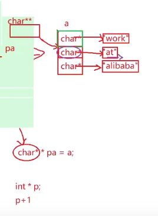
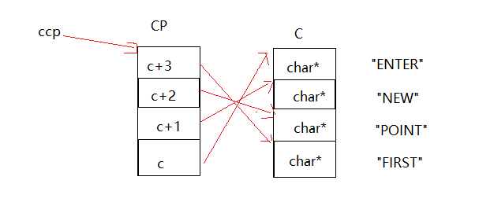
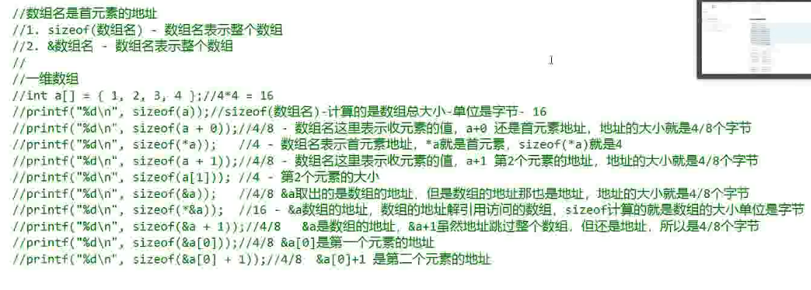
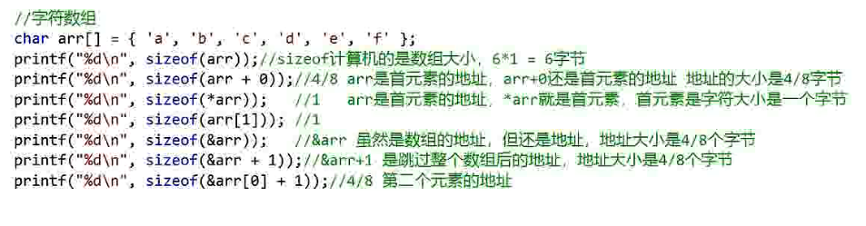
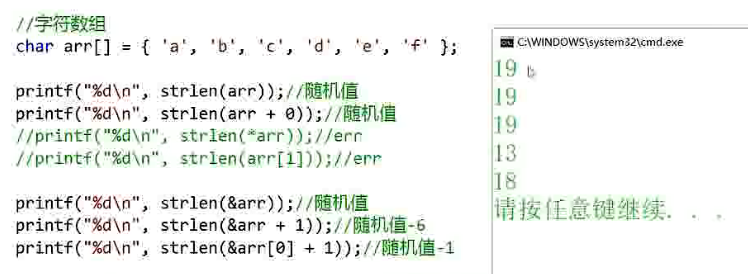
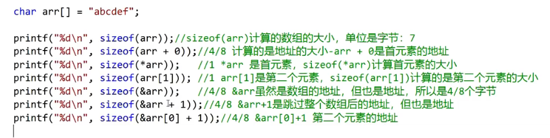
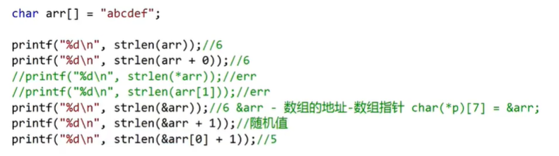
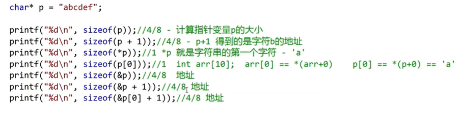
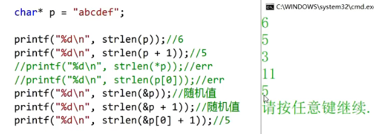
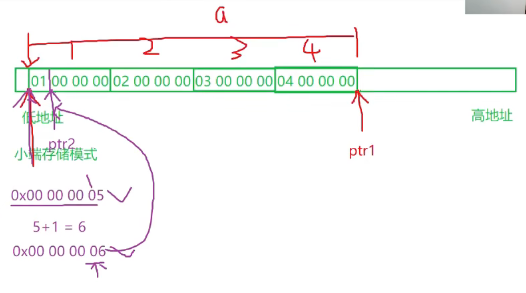

## 指针

### 指针的定义与使用
- 取变量地址使用&符号
- 定义指针变量时，使用 *var，说明: 该var变量是指针变量，不是普通变量，var赋值的内容是变量地址；
- 使用指针变量时，*var表示：读取var所保存变量地址指向的存储空间内容；

```C
取变量地址使用&符号
定义指针变量时，使用 *var，说明: 该var变量是指针变量，不是普通变量，var赋值的内容是变量地址；
使用指针变量时，*var表示：读取var所保存变量地址指向的存储空间内容；
```


### 指针类型的意义：
- 指针类型决定了指针 * 解引用操作能访问几个字节
  - char* p; *p 能访问1个字节
  - short* p; *p 能访问2个字节
  - int* p; *p 能访问4个字节
  - double* p; *p 能访问8个字节
- 指针类型决定了指针 +1，-1, 加的或者减的是几个字节（或者 加的或者减的是几个地址，左移或者右移几个地址）
  - char* p; p+1 增加一个字符（本质是加一个地址，移动一个字节）
  - short* p; p+1 增加一个short 整型（本质是加2个地址，移动2个字节）
  - int *p; p+1 增加一个int 整型（本质是加4个地址，移动4个字节）
  - double* p; p+1 增加一个double 浮点型（本质是加8个地址，移动8个字节）

### 指针变量详解

- 指针变量类型：自身的类型、指向的类型
- **自身的类型**：在指针变量定义的时候，将变量名涂黑，剩下啥类型 指针变量就是啥类型

```C
int *p, p 自身类型是int *
```

- 指向的类型：在指针定义的时候，将变量名和离他最近的 * 一起涂黑，剩下啥类型，指针变量指向的类型就是啥类型
- 
```C
  int ***p，自身类型是int ***,指向类型是int **
   作用：决定了指针变量+1跳过的单位跨度；
        决定了指针变量所取存储空间内容的宽度；
```
```C
e.g.
           1、char *p, p指向char类型，因为char类型是1byte,则p+1跳过单位跨度为1byte
            
           2、int num = 0x44332211; //小端存储 11223344；
              char *p = &num //char *p; p = &num; p 是char *类型，*p = 0x11
              printf("*p = %#x\n",*p); //int -> char 强制转换，输出结果为*p = 0x11
              *p = 0; // *p位置的值置0 ，小端存储 00223344
              printf("*p = %#x\n",*p);   //输出结果为*p = 0x00
              printf("num = %#x\n",num); //输出结果为num = 0x44332200,因为char *p指向类型是
                                         //char是一个字节，且*p代表所存变量地址指向存储空间的内
                                         //容，通过指针p的指向类型char操作*p代表所存变量地址指向
                                         //存储空间的内容，且只能操作一个字节
```


```C
// 连续读取0x03 0x02，

char* p5 = &num; // num = 0x01020304; p5 存放num的地址，*p5 = 0x01020304；小端存放形式为0x04030201
p5++; // 地址每加1, 向右移动一个字节, 指向 0x03 的地址
p5 = (short*) p5; // 将 p5, char类型指针强制转换为指向类型为short两个字节且自身类型为short*的类型；起始地址指向03的地址
printf("*p5 = %#x\n", *p5); // 起始地址指向03的地址，1次读取一个short 长度的值，读取的结果为 0x0302，从小端存储 打印出来是0x0203

// 定义 p5 指针变量 char 1个字节类型，char* p5, 每次+1可以取一个，p5+1 地址指向0x03值的地址, 使用*(short*)p5 将p5强制转换为指向类型为short 两个字节，自身类型为short*的类型，进而读出0x03 0x02
```


### 野指针

```C

int* test(void)
{
	int* ptr; // 非法访问内存，ptr没赋初值，操作野指针
	*ptr = 10;
	return ptr;
}


```

- 指针未初始化

- 解决方法：
  - 当不知道初始化什么值时，可以使用NULL
  - 
- 指针越界访问
  - 函数作用完后将地址指向的空间释放，当前*p=20的操作，虽然指向地址没变，但是指向地址的空间已经不是test()函数作用的空间了
```
  - 

### 指针使用-注意事项
- 使用之前检查有效性
- 初次使用时，正确初始化
- 暂时不使用时，赋值NULL
- 再次使用时，使用if语句判断后再进行操作

### 指针 + - 整数
- 指针p++表示p = p+1
- 指针p+=1也表示p = p+1
- 指针p+=2 表示p = p+2
- p-=2也是同理
- 
- 

### 指针 - 指针
- 指向同一个内存空间的两个指针相减，得到的结果是两个指针之间的元素个数
- 不是两个指针之间的字节个数
- 下图中//err注释部分为错误写法
- 

### 指针的关系运算


以上两种代码方式，优先选择第一种，实际在绝大部分的编译器上是可以顺利完成任务的，然而我们还是应该避免这样写，因为第二种写法C标准并不保证它可行。

- 标准规定：
允许指向数组元素的指针与指向数组最后一个元素后面的那个内存位置的指针比较，但是不允许与指向第一个元素之前的那个内存位置的指针进行比较

- 没有越界数组可以访问尾元素+1的地址但是不能访问首元素-1的地址


### 二级指针
- 指针变量也是变量，是变量就有地址，那指针变量的地址存放在哪里？这就是二级指针
- 每级指针通过读取地址，依次访问地址对应的上级的值


### 字符指针
- char* pa = "abcdef";
- "abcdef"是常量字符串，指针 pa 中存放的地址是常量字符串首元素 a 的地址, *pa 结果为 'a'
- 从首地址开始，pa++, 依次指向地址存储的是 {'b','c','d','e','f',\0}
- pa+1 得到常量字符串元素 b 的地址，打印 *(pa+1) 结果是 b
- \*pa = 'A'; err, 因为 指针 pa 中存放的是常量字符串的地址，*pa操作无法修改**常量字符串**
- 为防止 *pa 被修改发现不易，定义时可以这样写: const char* pa = "abcdef"; 错误提示更加明显
- *(pa+i) == pa[i] 它们完全等价，除了数组，字符指针也可以使用，

```C

// 例1
int main()
{
	char ch = 'a'; 
	char* p = &ch; 
	*p = 'd'; // *取值 对指针赋值
	printf("%c\n", ch); // 输出d

	char arr[] = "hello C world"; 
	char* pc = arr;

	char* pa = "abcdef"; //"abcdef"是常量字符串，指针 pa 中存放的地址是常量字符串首元素 a 的地址
	printf("%c\n", *pa); // 打印a
	printf("%c\n", pa[0]); // 打印a，*(pa+i) == pa[i] 除了数组，字符指针也可以使用，它们完全等价
	printf("%c\n", *(pa+1)); // 打印b
	printf("%s\n", pa); // 打印abcdef

	// *pa = 'A'; // err
	              // 因为 指针pa中存放的是常量字符串的地址，*pa操作无法修改 常量字符串
	// 为防止 *pa 被修改，定义时可以这样写
	// const char* pa = "abcdef";
	printf("%s\n", pa);

	printf("%s\n", arr);
	printf("%s\n", pc); // arr pc 打印结果都是 hello C world
	printf("%c\n", *pc);//打印h,说明字符串数组名是首元素地址
	
	return 0;
}

```

- 虽然str1 和str2 两个数组存放的内容相同，但是在内存中是分别开辟两个空间，因为不同数组名代表不同的数组地址
- 因为字符串常量只可以使用、无法被修改，str3 和str4 存放的两个字符串常量首元素地址相同，在内存中是同一份存在

```C

// 例2
int main()
{
	char str1[] = "hello";
	char str2[] = "hello";
	// 数组中存放形式为：str[] = {'h','e','l','l','o',\0}; 虽然str1 和str2 两个数组存放的内容相同，但是在内存中是分别开辟两个空间，因为不同数组名代表不同的数组地址

	/*
	char* str3 = "hello";
	char* str4 = "hello";
	*/

	// const 修饰的*str 更加健壮，防止*str 被修改发生segmentfault 错误而不提示
	const char* str3 = "hello";
	const char* str4 = "hello";
	// 指针str3 和str4中存放的是字符串常量首元素 h 的地址，因为字符串常量只可以使用、无法被修改，str3 和str4 存放的两个字符串常量首元素地址相同，在内存中是同一份存在


	if (str1 == str2)
		printf("str1 and str2 are same\n");
	else
		printf("str1 and str2 are not same\n"); // 打印
	
	if (str3 == str4)
		printf("str3 and str4 are same\n"); // 打印
	else
		printf("str3 and str4 are not same\n");

	return 0;
}

```

### 特殊字符指针辨析

```C
//判断表达式的真假：(*dst++ = *src++)!= '\0'
char dst[] = "hehexxxxxxxxxxxxx";
char src[] = "haha";

```

- 表达式(*dst++ = *src++)，当*src = '\0' 赋值给*dst++时，dst++表达式返回结果为 dst，然后 *dst，之后 dst = dst+1保留值参与下次 *，此时完成表达式 *dst++ = *src++ 的返回结果为 *dst 的值 '\0'；
- 表达式 (*dst++ = *src++)!= '\0', 但是 '\0' == '\0', 表达式 (*dst++ = *src++)!= '\0' 返回 假


### 结构体指针

- struct 标记 / 结构名* 结构变量;
  - 定义结构体指针，结构变量自身类型为 struct 标记 / 结构名*，指针指向类型为 struct 标记 / 结构名
  - 访问结构体内部变量
    - 结构体变量 sb. 成员 
    - 结构体指针变量 sp-> 成员

```C
// 结构体指针定义的p1 p2
struct Test
{
	int Num;
	char* pcName;
	short sDate;
	char cha[2];
	short sBa[4];
}* p1;

struct Test* p2;

```

```C
void print2(struct T* tmp) // 结构体 传地址 比 传实参更加高效
{
	printf("%s\n", tmp->ch);  // hehe
	printf("%s\n", tmp->s.arr); // hello world
	printf("%lf\n", tmp->s.d); // 3.14
	printf("%s", tmp->p); // hello bit，换行
}

int main()
{
	char arr[] = "hello bit\n"; // hello bit 换行
	struct T t = { "hehe", {100, 'w', "hello world", 3.14}, arr }; // 初始化时，使用{}包裹，结构体中 结构体初始化仍然使用{}包裹
  
  print2(&t);

	return 0;
}

```

### 指针数组

[指针数组参考](../Array/array.md/#指针数组)

- 数组中元素的值即为地址，存放该指针(元素)指向类型的地址
- int* arr1[10]; int* arr2[]; arr1是指针数组，因为数组定义未初始化时，元素个数不能省略； 
- 主要应用方向

```C

// 指针数组,高级用法1
int main()
{
	int arr1[] = { 1,2,3,4,5 };
	int arr2[] = { 2,3,4,5,6 };
	int arr3[] = { 3,4,5,6,7 };

	int* parr[] = { arr1, arr2, arr3 }; // 高级用法1
	for (int i = 0; i < 3; i++)
	{
		for (int j = 0; j < 5; j++)
		{
			printf("%d ", *(parr[i] + j));
		}
		printf("\n");
	}

	return 0;
}

```

### 指针数组元素的指针-指针的指针

- 指针的指针，类型定义
  - char* a[] = { "work","at","alibaba" };
  - char** pa = a; 
    - \*pa 指 pa是一个指针，char\*\* pa指 pa指针(\*pa)指向类型为char\*



```C
// 示例1
int main()
{
	char* a[] = { "work","at","alibaba" }; // a 是指针数组，数组内部存放元素类型为char* 指针
	char** pa = a; // 数组名a为首元素地址，数组内部存放元素类型为char*，那么指向数组内部元素的指针类型为 char**
	pa++; // pa为指向数组内部元素的指针，pa+1, 向后移动一个元素(即"at")，步长为char*
	printf("%s\n", *pa); // *pa 拿到数组元素，且数组元素为地址，直接即可被 %s 打印

	return 0;
}

```



```C
// 示例2
int main()
{
	char* c[] = { "ENTER","NEW","POINT","FIRST" };
	char** cp[] = { c + 3,c + 2,c + 1,c };
	char*** cpp = cp;

	printf("%s\n", **++cpp); // POINT
	// cpp = cpp+1, 指向 cp 中 c+2 的地址，*(c+2), 拿到 c+2 的值, cp中c+2的值为c中c+2的地址，**(c+2) 拿到c中c+2的值，即为POINT的首元素地址

	printf("%s\n", *-- * ++cpp + 3); // ER
	// ++cpp即为 cpp = cpp+1, 此时cpp指向 cp 中 c+2 的地址, +1 指向cp中c+1的地址，* ++cpp 取得cp中c+1的地址的值为c+1, c+1指向 C中c+1的地址，--* ++cpp，在C中将c+1的地址上移动一个，得到c的首元素地址，*-- * ++cpp 得到首元素地址指向的值为"ENTER"的首元素地址，*-- * ++cpp + 3 将"ENTER"的首元素地址移动3位得到 ER

	printf("%s\n", *cpp[-2] + 3); // ST
	// 此时cpp指向 cp 中c+1的地址, cpp[-2] == *(cpp-2), *cpp[-2] + 3 == **(cpp-2)+3,此时cpp上移2位，到达cp中c+3的地址，解引用拿到c+3该值，c+3的值指向c中c+3的地址，再次解引用拿到c中c+3的值为"FIRST"的首地址，+3右移3位，%s打印 ST

	printf("%s\n", cpp[-1][-1] + 1); // EW
	// *(*(cpp-1)-1)+1，此时cpp指向的值没变，仍为 cp 中c+1的地址， 上移一位，到达cp中c+2的地址，解引用拿到c+2的值，c+2-1=c+1，c+1的值指向c中c+1的地址，解引用拿到c中c+1地址的值为"NEW"的首元素地址，+1向后移动一位，打印 EW

	return 0;
}


```

### 数组指针
- 是指针，指向数组的指针，用来存放数组地址

- 差异：
  - 指针：存放一个地址，或者数组中某个元素的地址，或者数组名代表的数组首地址
  - 数组：一类元素的集合

- 数组类型
    - 数组类型: 由 元素类型 和 元素个数 共同决定
    - int array[10] 
      - 数组类型是 int [10], 其中 int 是元素类型，[10] 是元素个数
      - 对于数组变量的定义，通常将变量名放在数组类型之后，int [10] array, 但是为了看着舒服，因此规定定义方式为: int array[10];
    - 优先级: 小括号 () > 中括号 [] > 解引用 * ，它们的结合方向都是自左向右
      - 指针数组：int* array[10] = NULL; [] 的优先级高于 \*，所以 array 先与[]结合构成数组，数组内存放的元素是int* 指针；
        - 指针数组类型：int* [10]
        - 数组中存放的10个元素的类型为 int* 指针；
        - 指针指向 int 类型
      - 数组指针: int (*array)[10], 因为\* 的优先级高于[], 所以使用()提升优先级
    	- array 是指针，int (*) [10]是数组指针类型，无数组名
    	- *array 拿到的是数组名，遵从[一维、二维数组名的使用方法](../Array/array.md/#数组名是什么)
        - 含义：指针 array 指向一个大小为10个整型的数组;
        - 用处：二维及以上维度数组arr[3][5]，数组名作为参数使用，数组名 arr 即为二维数组首元素的地址；二维数组 arr[3][5] 是由 3个 一维数组组成, 见下面的练习


- 一维数组名是首元素地址，二维数组名是第一行一维数组的数组地址
- 是首元素地址有两个例外
  - sizeof(arr)不行，arr表示整个数组，计算的是整个数组（数组中所有元素的集合）存储空间的大小，单位字节；
  - &arr不行，arr表示整个数组，取出的是整个数组的地址
  - 虽然arr &arr[0] &arr 内存地址相同，但是&arr取出的是整个数组的起始地址，&arr+1表示的是数组中最后一个元素后一个元素的地址，如下图
  - 除了以上两种情况以外，所有的数组名都表示数组首元素的地址；


### 函数指针

[函数的定义](../Functions/functions.md/#函数的定义)

return_type function_name( define_parameter1_type parameter1, ...)

- 定义：指向函数的指针 - 存放函数地址的一个指针
- &函数名 和 函数名 都是函数的地址；不同于 &数组名 和 数组首元素地址中 +1 移动地址的差异性
- int Add(int a, int b)是函数名，如何将 Add 赋值到一个指针pf, 该指针类型是 函数指针
  - int* pf(int a, int b) = Add; ()的优先级高于*，pf 先与()结合成了函数，不合理
  - int(*pf)(int a, int b) = Add; 此时 pf 是指针，指向函数类型 int (int a, int b, ...) 的指针，存放int (int a, int b, ...)函数类型的函数地址
- 函数指针是否使用 * **解引用**，最终操作结果无影响

```C

printf("%d\n", (*p)(3, 4));
printf("%d\n", p(3, 4)); // 因为 Add是函数名 也是地址，Add 传给指针p, p中存放的也是Add 函数的地址，所以不用加* 也可以使用

printf("%d\n", (**p)(3, 4));
printf("%d\n", (***p)(3, 4));
// 以上四种方式打印的结果都相同，后面两种 (**p)(3, 4)、(***p)(3, 4)也没有错，但是不建议使用，加* 多此一举

```

```C

// 示例1
int Add(int a, int b)
{
	return a + b;

}

void Print(char* str)
{
	printf("%s\n",str);
}

int main()
{
	printf("%p\n", Add);
	printf("%p\n", &Add); //%p 打印的 &Add 和 Add 相同
	
	int (*p)(int a, int b) = Add;
	printf("%d\n", (*p)(3, 4));
	printf("%d\n", p(3, 4)); // 因为 Add是函数名 也是地址，Add 传给指针p, p中存放的也是Add 函数的地址，所以不用加* 也可以使用

	printf("%d\n", (**p)(3, 4));
	printf("%d\n", (***p)(3, 4));
	// 以上四种方式打印的结果都相同，后面两种 (**p)(3, 4)、(***p)(3, 4)也没有错，但是不建议使用，加* 多此一举
	
	void (*p1)(char* str) = Print; 
	(*p1) ("hello bit"); // p1 中存放的是 函数指针，*p1 拿到函数名，直接调用字符串数组，打印为：hello bit


	return 0;
}

// 示例2

// 2-1 功能：将 地址0 强制类型转化 函数指针，并调用该(地址为0)函数
(*(void(*)())0)();     // void(*)() - 返回类型为void 、无形参的函数指针类型；
					   // *(void(*)())0 - () 的优先级高于 *，*(void (*)()) 函数地址的解引用取得函数名不会执行，先执行(void (*)())0
					   // (void(*)())0 - 0 默认是int 型，使用函数指针类型 void (*)() 强制类型转化 0 为一个函数的地址，该函数 是无返回值、无形参的
					   // *(void(*)())0 - 使用 * 解引用操作，拿到函数地址为零的函数名
					   // (*(void (*)())0)() - 函数的调用，无实参

// 2-2 如何简化如下代码
void (*signal(int, void(*)(int))) (int);
// 1. void (*   signal(int, void(*)(int))   ) (int), 
// signal(int, void(*)(int)) 函数的返回类型是什么？函数形参 void(*)(int) 是什么？
// 返回类型：void(*)(int)；形参是函数指针
typedef void(*FuncPointer)(int); // 函数指针类型，别名为 FuncPointer
// 2. 代码改写
FuncPointer(signal(int, FuncPointer));


// 示例3
typedef int* pInts[10]; // 指针数组类型重命名 标记为pInts
int main()
{
    int arr[10] = { 1,2,3,4 };
    pInts pIs;
    for (int i = 0; i < 10; ++i)
        pIs[i] = &(arr[i]);
    for (int i = 0; i < 10; ++i)
        printf("%d ", *(pIs[i])); // 打印 1 2 3 4 0 0 0 0 0 0

    return 0;
}

typedef int(*pints)[10]; // 数组指针类型重命名
int main()
{
    int arr[10] = { 1,2,3,4 };
    pints pis = &arr;
    for (int i = 0; i < 10; ++i)
        printf("%d ", (*pis)[i]); // 打印 1 2 3 4 0 0 0 0 0 0
}

```

### 函数指针数组
- 将多个函数地址存放到一个指针数组中
- int (*p[])()
  - p[] 数组
  - int (*)() 函数指针
  - int () -> int (\*)() -> int (*p[])()
  - 写成 int *p[]()时，因为优先级和从左到右的结合，p[]()没有意义，错误
- 函数指针数组的用途：转移表

```C

// 直接将相同类型的函数名存放到函数指针数组中
void test()
{
	int a = 0;
	int b = 0;
	int func = 0;
	int (*fpA[5])(int, int) = { 0, Plus, Minu, Times, Div };

	do {
		menu();
		int sum = 0;
		printf("please chose:>");
		scanf("%d", &func);
		if (func >= 1 && func <= 4)
		{
			printf("please input2 numbers:>");
			scanf("%d%d", &a, &b);

			while (b != 0)
			{
				sum = fpA[func](a, b); // 函数指针数组中调用函数并传参
				printf("%d\n", sum);
				break;
			}
		}
		else if (0 == func)
		{
			printf("exit!");
			break;
		}
		else
		{
			printf("wrong,please try again\n");
		}

	} while (func);
}

```
### 指向函数指针数组的指针-函数指针数组指针

- 函数指针数组指针 是一个指针，指向函数指针数组，数组中每个元素是函数指针
- int (*)(int, int) - 函数指针
- int(*arr[])(int,int) - 函数指针数组
- int(\*(\*arr)[]))(int,int) - (*arr)[] 数组指针


### 回调函数
- 定义：把函数的指针（地址）作为参数传递给另一个函数，当这个指针被用来调用其所指向的函数时，我们就说这是回调函数


- 回调函数 示例1
- 
```C

// 回调函数
void Clc(int(*fp)(int,int)) // 定义函数指针，传入函数地址调用函数
{
	int x, y;
	int ret = 0;
	printf("输入操作数：");
	scanf("%d %d", &x, &y);
	ret = fp(x, y);
	printf("ret = %d\n", ret);
}


// 语句中多次重复的语句和不同函数的调用 改写，使用回调函数 Clc 即可表达含义 
switch (input)
{
case 1:
	/*printf("输入操作数：");
	scanf("%d %d", &x, &y);
	ret = Add(x, y);
	printf("ret = %d\n", ret);*/

	Clc(Add); // 传入 Add 函数
	break;
case 2:
	/*printf("输入操作数：");
	scanf("%d %d", &x, &y);
	ret = Minu(x, y);
	printf("ret = %d\n", ret);*/

	Clc(Minu); // 传入 Minu 函数
	break;
default:
	printf("选择错误\n");
	break;
}

```

- 回调函数 示例2：库函数 qsort-快速排序算法 (quick sort)

```C

void qsort( void \*ptr, size_t count, size_t size, int (*comp)(const void *, const void *)) 

```

```C

// int (*comp)(const void *, const void *)
int cmp_chars(const void* q1, const void* q2) // 快速排序算法，q1 q2 是库函数内部调用的，当前函数只需要比较两个无类型值大小即可
{
	       // 字符串比较不能用 < = > 符号
	return strcmp((char*)q1, (char*)q2); // void* 无类型指针 -> char* 字符指针的强制转换，接受的是指针，不需要解引用
	
	/*if (*((int*)q1) > * ((int*)q2))
		return 1;
	else if (*((char*)q1) == *((char*)q2))
		return 0;
	else
		return - 1;*/
}


int cmp_ints(const void* q1, const void* q2) // 快速排序算法，q1 q2 是库函数内部调用的，当前函数只需要比较两个无类型值大小即可
{
	// 字符串比较不能用 < = > 符号
	if (*(int*)q1 > *(int*)q2)
		return 1;
	else if (*(char*)q1 == *(char*)q2)
		return 0;
	else
		return - 1;
}


int cmp_struct_age(const void* q1, const void* q2) // 快速排序算法，q1 q2 是库函数内部调用的，当前函数只需要比较两个无类型值大小即可
{
	

	if (((struct Stu*)q1)->age > ((struct Stu*)q2)->age) // 使用 -> 指针访问结构体内部，可以直接拿到值，无需解引用
		return 1;
	else if (((struct Stu*)q1)->age == ((struct Stu*)q2)->age)
		return 0;
	else
		return - 1;
}

void test_qchars()
{
	char str[] = "nmlkjihgfedcba";
	int size = strlen(str);

	qsort(str, size, sizeof(char), cmp_chars); // quick sort
	printf("%s", str);

}

void test_bchars()
{
	char str[] = "abcdefghijklkmn";
	int size = strlen(str);

	bsort(str, size, sizeof(char), cmp_chars); // bubble_sort
	printf("%s", str);

}

struct Stu 
	{
		char name[5];
		int age;
	}

void test_bstruct_age()
{
	struct Stu s[3] = {{"liming",18},{"xiaohong",22},{"xiaozhang",20}};
	int size = sizeof(s)/sizeof(s[0]);

	bsort(str, size, sizeof(s[0]), cmp_struct_age); // bubble_sort
	
	for(int i=0;i<3;i++)
	{
		printf("%d ", s[i].age);
	}
	
}

int main()
{
	test_qchars();

	test_bchars();
}


```

- 如何写一个多类型可用的冒泡排序(bubble sort)算法 bsort()

```C

void bsort(void* arr, int size, int width, int (*cmp)(void* b1, void* b2))
{
	for (int i = 0; i < size - 1; i++)
	{
		for (int j = 0; j < size - 1 - i; j++)
		{
			char* p1 = (char*)arr + j * width;
			char* p2 = (char*)arr + (j + 1) * width; //之所以都强制转换为char* 操作，因为arr的类型可以是 int char short double等，都可以转化为char 一个字节进行操作
			
			if (cmp(p1,p2)>0) // 升序
			// if(cmp((char*)arr + j * width, (char*)arr + (j + 1) * width))
				// void* 指针可以接受任意类型指针，char* 指针 p1((char*)arr + j * width) 传给形参 无类型指针 void* b1，此时 b1 需要先强制类型转化才能进行 + - 指针操作，* 解引用操作 

				// 数组类型比较方式 *(arr+j) > *(arr+j+1) 
				// 字符串的比较需要使用 strcmp()
				// 结构体类型变量获取需要使用 . 或者 ->

				// 所以这里应用设计一个 通用类型 - 函数指针的方法比较合适
				// 多种变量类型操作和作为形参输入，这里可以使用void* 类型接收

			{
				// 交换大小值
				for (int k = 0; k < width; k++) // 逐字节交换，不是类似int a[] = {1,3,4};a[0] = a[1], 按造元素进行交换的
				{
					char tmp = *p1;
					*p1 = *p2;
					*p2 = tmp;
					p1++;
					p2++;
				}

			}
			
		}
	}
}

```

### 指针传参

[指针作为函数参数](../Array/array.md/#数组作为函数参数)

- 二级指针传参

```C

void test(int** ptr) // ptr 可以接受一级指针的地址；二级指针；指针数组
{
	printf("num = %d\n", **ptr);
}

int main()
{
	int n = 10;
	int* p = &n;
	int* arr[10] ={0};


	int** pp = &p; // 二级指针 存放一级指针的地址
	test(pp);
	test(&p);
	test(arr);


	return 0;
}
```


### 数组-指针的计算

- 整型数组



- 字符数组



- strlen 只要遇到 \0 就停止，计算的是 \0 之前的长度，\0 也有大小
- strlen() 入口参数是const char* 类型, strlen(&arr) 中 &arr 的类型是 char(*)[7]，因此会有警告产生，不建议这样使用





- printf("%d\n",strlen(&arr)); &arr 是数组地址 == arr 数组首元素地址 == &arr[0] 数组首元素地址，但是含义不同。这里 数组地址&arr 变量类型是 char数组指针，被strlen函数强制转化为char指针



- 字符指针






### 指针-整数的计算

- 内存中最小的单位是 字节（byte）, 每个字节对应一个地址，每相邻的两个地址间隔一个字节
- 地址+1，地址增加1，向后移动一个字节
- ptr1[-1] == *(ptr1+(-1))



```C

int main()
{
	int a[4] = { 1, 2, 3, 4 };
	int* ptr1 = (int*)(&a + 1); 
	// &a+1, 数组地址+1，指针移动到的数组的尾端
	// ptr1[-1] == *(ptr1+(-1)); ptr1+(-1) 指ptr1指针向左（前）移动一个int型（4字节）

	int* ptr2 = (int*)((int)a + 1); 
	// (int)a+1 只是地址 数字 +1，地址增加1，移动一个字节
	// - 因为a被强制转化为类型 int，+1 只是数字 + - 运算，尽管a是int型，也不会移动 4byte
	// 假设a的地址是 0x00 00 00 05, +1，0x00 00 00 06

	printf("%x,%x", ptr1[-1], *ptr2); //

	return 0;
}

```
