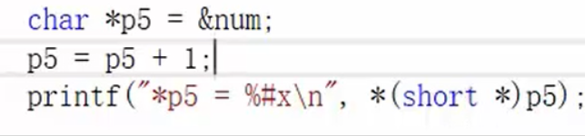

## 指针

### 指针的定义与使用
- 取变量地址使用&符号
- 定义指针变量时，使用 *var，说明: 该var变量是指针变量，不是普通变量，var赋值的内容是变量地址；
- 使用指针变量时，*var表示：读取var所保存变量地址指向的存储空间内容；

```C
取变量地址使用&符号
定义指针变量时，使用 *var，说明: 该var变量是指针变量，不是普通变量，var赋值的内容是变量地址；
使用指针变量时，*var表示：读取var所保存变量地址指向的存储空间内容；
```


### 指针类型的意义：
- 指针类型决定了指针 * 解引用操作能访问几个字节
  - char* p; *p 能访问1个字节
  - short* p; *p 能访问2个字节
  - int* p; *p 能访问4个字节
  - double* p; *p 能访问8个字节
- 指针类型决定了指针 +1，-1, 加的或者减的是几个字节（或者 加的或者减的是几个地址，左移或者右移几个地址）
  - char* p; p+1 增加一个字符（本质是加一个地址，移动一个字节）
  - short* p; p+1 增加一个short 整型（本质是加2个地址，移动2个字节）
  - int *p; p+1 增加一个int 整型（本质是加4个地址，移动4个字节）
  - double* p; p+1 增加一个double 浮点型（本质是加8个地址，移动8个字节）

### 指针变量详解

- 指针变量类型：自身的类型、指向的类型
- **自身的类型**：在指针变量定义的时候，将变量名涂黑，剩下啥类型 指针变量就是啥类型

```C
int *p, p 自身类型是int *
```

- 指向的类型：在指针定义的时候，将变量名和离他最近的 * 一起涂黑，剩下啥类型，指针变量指向的类型就是啥类型
- 
```C
  int ***p，自身类型是int ***,指向类型是int **
   作用：决定了指针变量+1跳过的单位跨度；
        决定了指针变量所取存储空间内容的宽度；
```
```C
e.g.
           1、char *p, p指向char类型，因为char类型是1byte,则p+1跳过单位跨度为1byte
            
           2、int num = 0x44332211; //小端存储 11223344；
              char *p = &num //char *p; p = &num; p 是char *类型，*p = 0x11
              printf("*p = %#x\n",*p); //int -> char 强制转换，输出结果为*p = 0x11
              *p = 0; // *p位置的值置0 ，小端存储 00223344
              printf("*p = %#x\n",*p);   //输出结果为*p = 0x00
              printf("num = %#x\n",num); //输出结果为num = 0x44332200,因为char *p指向类型是
                                         //char是一个字节，且*p代表所存变量地址指向存储空间的内
                                         //容，通过指针p的指向类型char操作*p代表所存变量地址指向
                                         //存储空间的内容，且只能操作一个字节
```


```C
// 连续读取0x03 0x02，

char* p5 = &num; // num = 0x01020304; p5 存放num的地址，*p5 = 0x01020304；小端存放形式为0x04030201
p5++; // 地址每加1, 向右移动一个字节, 指向 0x03 的地址
p5 = (short*) p5; // 将 p5, char类型指针强制转换为指向类型为short两个字节且自身类型为short*的类型；起始地址指向03的地址
printf("*p5 = %#x\n", *p5); // 起始地址指向03的地址，1次读取一个short 长度的值，读取的结果为 0x0302，从小端存储 打印出来是0x0203

// 定义 p5 指针变量 char 1个字节类型，char* p5, 每次+1可以取一个，p5+1 地址指向0x03值的地址, 使用*(short*)p5 将p5强制转换为指向类型为short 两个字节，自身类型为short*的类型，进而读出0x03 0x02
```



### 野指针
- 指针未初始化

- 解决方法：
  - 当不知道初始化什么值时，可以使用NULL
  - 
- 指针越界访问
  - 
- 指针指向的空间释放
```C
示例：test()函数作用完后将地址指向的空间释放，当前*p=20的操作，虽然指向地址没变，但是指向地址的空间已经不是test()函数作用的空间了
```
  - 

### 指针使用-注意事项
- 使用之前检查有效性
- 初次使用时，正确初始化
- 暂时不使用时，赋值NULL
- 再次使用时，使用if语句判断后再进行操作

### 指针 + - 整数
- 指针p++表示p = p+1
- 指针p+=1也表示p = p+1
- 指针p+=2 表示p = p+2
- p-=2也是同理
- 
- 

### 指针 - 指针
- 指向同一个内存空间的两个指针相减，得到的结果是两个指针之间的元素个数，下图中//err注释部分即为错误写法
- 

### 指针的关系运算


以上两种代码方式，优先选择第一种，实际在绝大部分的编译器上是可以顺利完成任务的，然而我们还是应该避免这样写，因为第二种写法C标准并不保证它可行。

- 标准规定：
允许指向数组元素的指针与指向数组最后一个元素后面的那个内存位置的指针比较，但是不允许与指向第一个元素之前的那个内存位置的指针进行比较


### 二级指针
- 指针变量也是变量，是变量就有地址，那指针变量的地址存放在哪里？这就是二级指针
- 每级指针通过读取地址，依次访问地址对应的上级的值


### 字符指针
- char* pa = "abcdef"; // "abcdef"是常量字符串，指针 pa 中存放的地址是常量字符串首元素 a 的地址
- \*pa = 'A'; err, 因为 指针 pa 中存放的是常量字符串的地址，*pa操作无法修改**常量字符串**
- 为防止 *pa 被修改，定义时可以这样写: const char* pa = "abcdef";
- 虽然str1 和str2 两个数组存放的内容相同，但是在内存中是分别开辟两个空间，因为不同数组名代表不同的数组地址
- 因为字符串常量只可以使用、无法被修改，str3 和str4 存放的两个字符串常量首元素地址相同，在内存中是同一份存在

```C

// 例1
int main()
{
	char ch = 'a'; 
	char* p = &ch; 
	*p = 'd'; // *取值 对指针赋值
	printf("%c\n", ch); // 输出d

	char arr[] = "hello C world"; 
	char* pc = arr;

	char* pa = "abcdef"; //"abcdef"是常量字符串，指针 pa 中存放的地址是常量字符串首元素 a 的地址
	printf("%c\n", *pa); // 打印a
	printf("%s\n", pa); // 打印abcdef

	// *pa = 'A'; // err
	              // 因为 指针pa中存放的是常量字符串的地址，*pa操作无法修改 常量字符串
	// 为防止 *pa 被修改，定义时可以这样写
	// const char* pa = "abcdef";
	printf("%s\n", pa);

	printf("%s\n", arr);
	printf("%s\n", pc); // arr pc 打印结果都是 hello C world
	printf("%c\n", *pc);//打印h,说明字符串数组名是首元素地址
	
	return 0;
}

// 例2
int main()
{
	char str1[] = "hello";
	char str2[] = "hello";
	// 数组中存放形式为：str[] = {'h','e','l','l','o',\0}; 虽然str1 和str2 两个数组存放的内容相同，但是在内存中是分别开辟两个空间，因为不同数组名代表不同的数组地址

	/*char* str3 = "hello";
	char* str4 = "hello";*/

	// const 修饰的*str 更加健壮，防止*str 被修改发生segmentfault 错误而不提示
	const char* str3 = "hello";
	const char* str4 = "hello";
	// 指针str3 和str4中存放的是字符串常量首元素 h 的地址，因为字符串常量只可以使用、无法被修改，str3 和str4 存放的两个字符串常量首元素地址相同，在内存中是同一份存在


	if (str1 == str2)
		printf("str1 and str2 are same\n");
	else
		printf("str1 and str2 are not same\n"); // 打印
	
	if (str3 == str4)
		printf("str3 and str4 are same\n"); // 打印
	else
		printf("str3 and str4 are not same\n");

	return 0;
}

```

### 指针数组

[指针数组参考](../Array/array.md/#指针数组)

- 主要应用方向

```C

// 指针数组,高级用法1
int main()
{
	int arr1[] = { 1,2,3,4,5 };
	int arr2[] = { 2,3,4,5,6 };
	int arr3[] = { 3,4,5,6,7 };

	int* parr[] = { arr1, arr2, arr3 }; // 高级用法1
	for (int i = 0; i < 3; i++)
	{
		for (int j = 0; j < 5; j++)
		{
			printf("%d ", *(parr[i] + j));
		}
		printf("\n");
	}

	return 0;
}

```

### 数组指针
- 是指针，指向数组的指针，用来存放数组地址

- 差异：
  - 指针：存放一个地址，或者数组中某个元素的地址，或者数组名代表的数组首地址
  - 数组：一类元素的集合

- 数组类型
    - 数组类型: 由 元素类型 和 元素个数 共同决定
    - int array[10] 
      - 数组类型是 int [10], 其中 int 是元素类型，[10] 是元素个数
      - 对于数组变量的定义，通常将变量名放在数组类型之后，int [10] array, 但是为了看着舒服，因此规定定义方式为: int array[10];
    - 优先级: 小括号 () > 中括号 [] > 解引用 * ，它们的结合方向都是自左向右
      - 指针数组：int* array[10] = NULL; [] 的优先级高于 \*，所以 array 先与[]结合构成数组，数组内存放的元素是int* 指针；
        - 指针数组类型：int* [10]
        - 数组中存放的10个元素的类型为 int* 指针；
        - 指针指向 int 类型
      - 数组指针: int (*array)[10], 因为\* 的优先级高于[], 所以使用()提升优先级
    	- *array 是指针，int [10]是数组类型，无数组名。
        - 含义：指针 array 指向一个大小为10个整型的数组;
        - 用处：二维及以上维度数组arr[3][5]，数组名作为参数使用，数组名 arr 即为二维数组首元素的地址；二维数组 arr[3][5] 是由 3个 一维数组组成, 见下面的练习


- 一维数组名是首元素地址，二维数组名是第一行一维数组的数组地址
- 是首元素地址有两个例外
  - sizeof(arr)不行，arr表示整个数组，计算的是整个数组（数组中所有元素的集合）存储空间的大小，单位字节；
  - &arr不行，arr表示整个数组，取出的是整个数组的地址
  - 虽然arr &arr[0] &arr 内存地址相同，但是&arr取出的是整个数组的起始地址，&arr+1表示的是数组中最后一个元素后一个元素的地址，如下图
  - 除了以上两种情况以外，所有的数组名都表示数组首元素的地址；


### 函数指针

[函数的定义](../Functions/functions.md/#函数的定义)

return_type function_name( define_parameter1_type parameter1, ...)

- 定义：指向函数的指针 - 存放函数地址的一个指针
- &函数名 和 函数名 都是函数的地址；不同于 &数组名 和 数组首元素地址中 +1 移动地址的差异性
- int Add(int a, int b)是函数名，如何将 Add 赋值到一个指针pf, 该指针类型是 函数指针
  - int* pf(int a, int b) = Add; ()的优先级高于*，pf 先与()结合成了函数，不合理
  - int(*pf)(int a, int b) = Add; 此时 pf 是指针，指向函数类型 int (int a, int b, ...) 的指针，存放int (int a, int b, ...)函数类型的函数地址

```C

// 示例1
int Add(int a, int b)
{
	return a + b;

}

void Print(char* str)
{
	printf("%s\n",str);
}

int main()
{
	printf("%p\n", Add);
	printf("%p\n", &Add); //%p 打印的 &Add 和 Add 相同
	
	int (*p)(int a, int b) = Add;
	printf("%d\n", (*p)(3, 4));
	printf("%d\n", p(3, 4)); // 因为 Add是函数名 也是地址，Add 传给指针p, p中存放的也是Add 函数的地址，所以不用加* 也可以使用

	printf("%d\n", (**p)(3, 4));
	printf("%d\n", (***p)(3, 4));
	// 以上四种方式打印的结果都相同，后面两种 (**p)(3, 4)、(***p)(3, 4)也没有错，但是不建议使用，加* 多此一举
	
	void (*p1)(char* str) = Print; 
	(*p1) ("hello bit"); // p1 中存放的是 函数指针，*p1 拿到函数名，直接调用字符串数组，打印为：hello bit


	return 0;
}


// 示例2

// 2-1
(*(void(*)())0)();     // void(*)() - 返回类型为void 、无形参的函数指针类型；
					   // *(void(*)())0 - () 的优先级高于 *，*(void (*)()) 函数地址的解引用取得函数名不会执行，先执行(void (*)())0
					   // (void(*)())0 - 0 默认是int 型，使用函数指针类型 void (*)() 强制类型转化 0 为一个函数的地址，该函数 是无返回值、无形参的
					   // *(void(*)())0 - 使用 * 解引用操作，拿到函数地址为零的函数名
					   // (*(void (*)())0)() - 函数的调用，无实参

// 2-2 如何简化如下代码
void (*signal(int, void(*)(int))) (int);
// 1. void (*   signal(int, void(*)(int))   ) (int), 
// signal(int, void(*)(int)) 函数的返回类型是什么？函数形参 void(*)(int) 是什么？
// 返回类型：void(*)(int)；形参是函数指针
typedef void(*FuncPointer)(int); // 函数指针类型，别名为 FuncPointer
// 2. 代码改写
FuncPointer(signal(int, FuncPointer));


// 示例3
typedef int* pInts[10]; // 指针数组类型重命名
int main()
{
    int arr[10] = { 1,2,3,4 };
    pInts pIs;
    for (int i = 0; i < 10; ++i)
        pIs[i] = &(arr[i]);
    for (int i = 0; i < 10; ++i)
        printf("%d ", *(pIs[i])); // 打印 1 2 3 4 0 0 0 0 0 0

    return 0;
}

typedef int(*pints)[10]; // 数组指针类型重命名
int main()
{
    int arr[10] = { 1,2,3,4 };
    pints pis = &arr;
    for (int i = 0; i < 10; ++i)
        printf("%d ", (*pis)[i]); // 打印 1 2 3 4 0 0 0 0 0 0
}

```

#### 如何写一个 函数指针数组
- 将多个函数地址存放到一个指针数组中
- int (*p[])()
  - p[] 数组
  - int (*)() 函数指针
  - int () -> int (\*)() -> int (*p[])()

### 指针传参

[指针作为函数参数](../Array/array.md/#数组作为函数参数)

- 二级指针传参

```C

void test(int** ptr) // ptr 可以接受一级指针的地址；二级指针；指针数组
{
	printf("num = %d\n", **ptr);
}

int main()
{
	int n = 10;
	int* p = &n;
	int* arr[10] ={0};


	int** pp = &p; // 二级指针 存放一级指针的地址
	test(pp);
	test(&p);
	test(arr);


	return 0;
}

```