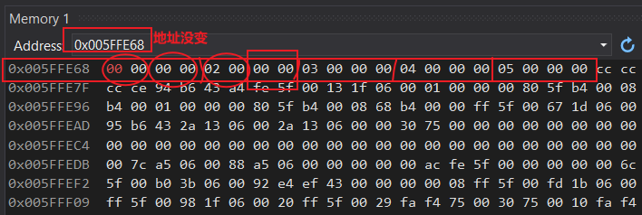

## 指针

### 指针的定义与使用
- 取变量地址使用&符号
- 定义指针变量时，使用 *var，说明: 该var变量是指针变量，不是普通变量，var赋值的内容是变量地址；
- 使用指针变量时，*var表示：读取var所保存变量地址指向的存储空间内容；

```C
取变量地址使用&符号
定义指针变量时，使用 *var，说明: 该var变量是指针变量，不是普通变量，var赋值的内容是变量地址；
使用指针变量时，*var表示：读取var所保存变量地址指向的存储空间内容；
```


### 指针类型的意义：
- 指针类型决定了指针 * 解引用操作能访问几个字节
  - char* p; *p 能访问1个字节
  - short* p; *p 能访问2个字节
  - int* p; *p 能访问4个字节
  - double* p; *p 能访问8个字节
- 指针类型决定了指针 +1，-1, 加的或者减的是几个字节（或者 加的或者减的是几个地址，左移或者右移几个地址）
  - char* p; p+1 增加一个字符（本质是加一个地址，移动一个字节）
  - short* p; p+1 增加一个short 整型（本质是加2个地址，移动2个字节）
  - int *p; p+1 增加一个int 整型（本质是加4个地址，移动4个字节）
  - double* p; p+1 增加一个double 浮点型（本质是加8个地址，移动8个字节）

### 指针变量详解
- 指针变量类型：自身的类型、指向的类型
- 自身的类型：在指针变量定义的时候，将变量名涂黑，剩下啥类型 指针变量就是啥类型

```C
int *p, p 自身类型是int *
```
- 指向的类型：在指针定义的时候，将变量名和离他最近的*一起涂黑，剩下啥类型，指针变量指向的类型就是啥类型
```C
  int ***p，自身类型是int ***,指向类型是int **
   作用：决定了指针变量+1跳过的单位跨度；
        决定了指针变量所取存储空间内容的宽度；
```
```C
e.g.
           1、char *p, p指向char类型，因为char类型是1byte,则p+1跳过单位跨度为1byte
            
           2、int num = 0x44332211; //小端存储 11223344；
              char *p = &num //char *p; p = &num; p 是char *类型，*p = 11
              printf("*p = %#x\n",*p); //输出结果为*p = 0x11
              *p = 0; // *p位置的值置0 ，小端存储 00223344
              printf("*p = %#x\n",*p);   //输出结果为*p = 0x00
              printf("num = %#x\n",num); //输出结果为num = 0x44332200,因为char *p指向类型是
                                         //char是一个字节，且*p代表所存变量地址指向存储空间的内
                                         //容，通过指针p的指向类型char操作*p代表所存变量地址指向
                                         //存储空间的内容，且只能操作一个字节
```


```C
// 连续读取0x03 0x02，

char* p5 = &num; // num = 0x01020304; p5 存放num的地址，*p5 = 0x01020304；小端存放形式为0x04030201
p5++; // 地址每加1, 向右移动一个字节, 指向 0x03 的地址
p5 = (short*) p5; // 将 p5, char类型指针强制转换为指向类型为short两个字节且自身类型为short*的类型；起始地址指向03的地址
printf("*p5 = %#x\n", *p5); // 起始地址指向03的地址，1次读取一个short 长度的值，读取的结果为 0x0302，从小端存储 打印出来是0x0203

// 定义 p5 指针变量 char 1个字节类型，char* p5, 每次+1可以取一个，p5+1 地址指向0x03值的地址, 使用*(short*)p5 将p5强制转换为指向类型为short 两个字节，自身类型为short*的类型，进而读出0x03 0x02
```


```C
/////////////////////////
/////类型强制转换/////////
/////////////////////////

int main()
{
	int arr[] = { 1, 2, 3, 4, 5 }; //arr数组地址为0x005ffe68, arr[0] 用16进制表示, 小端存储, 为0x01000000, 4个字节
	                               // arr[1] = 0x02000000
	short* p = (short*)arr; //强制转换为 short*类型指针, p指针存储 short 类型 arr 数组地址0x005ffe68, 在该地址上操作存储的值
	int i = 0;
	for (i = 0; i < 4; i++)  
	{
		*(p + i) = 0; //i = 0, 第一次操作arr[0] 中0100；
                  //i = 1, 第二次操作arr[0] 中0000；
                  //i = 2, 第三次操作arr[1] 中0200
	}

	for (i = 0; i < 5; i++)
	{
		printf("%d ", arr[i]);
	}
	return 0;
}
```
- 类型强制转换 操作过程

arr数组地址及其存储的值


p指针地址指向arr数组的地址，第一次操作，01变为00



p指针地址指向arr数组的地址，第三次操作,02变为00


### 野指针
- 指针未初始化

- 解决方法：
  - 当不知道初始化什么值时，可以使用NULL
  - 
- 指针越界访问
  - 
- 指针指向的空间释放
```C
示例：test()函数作用完后将地址指向的空间释放，当前*p=20的操作，虽然指向地址没变，但是指向地址的空间已经不是test()函数作用的空间了
```
  - 

### 指针使用-注意事项
- 使用之前检查有效性
- 初次使用时，正确初始化
- 暂时不使用时，赋值NULL
- 再次使用时，使用if语句判断后再进行操作

### 指针 + - 整数
- 指针p++表示p = p+1
- 指针p+=1也表示p = p+1
- 指针p+=2 表示p = p+2
- p-=2也是同理
- 
- 

### 指针 - 指针
- 指向同一个内存空间的两个指针相减，得到的结果是两个指针之间的元素个数，下图中//err注释部分即为错误写法
- 

### 指针的关系运算


以上两种代码方式，优先选择第一种，实际在绝大部分的编译器上是可以顺利完成任务的，然而我们还是应该避免这样写，因为第二种写法C标准并不保证它可行。

- 标准规定：
允许指向数组元素的指针与指向数组最后一个元素后面的那个内存位置的指针比较，但是不允许与指向第一个元素之前的那个内存位置的指针进行比较


### 数组指针
- 区分[指针数组](../Array/array.md/#指针数组)
- 差异：
  - 指针：存放一个地址，或者数组中某个元素的地址，或者数组名代表的数组首地址
  - 数组：一类元素的集合

- 数组名是首元素地址
- 是首元素地址有两个例外
  - sizeof(arr)不行，arr表示整个数组，计算的是整个数组（数组中所有元素的集合）存储空间的大小，单位字节；
  - &arr不行，arr表示整个数组，取出的是整个数组的地址
  - 
  - 虽然arr &arr[0] &arr 内存地址相同，但是&arr取出的是整个数组的起始地址，&arr+1表示的是数组中最后一个元素后一个元素的地址，如下图
  - 除了以上两种情况以外，所有的数组名都表示数组首元素的地址；


### 二级指针
- 指针变量也是变量，是变量就有地址，那指针变量的地址存放在哪里？这就是二级指针
- 每级指针通过读取地址，依次访问地址对应的上级的值

