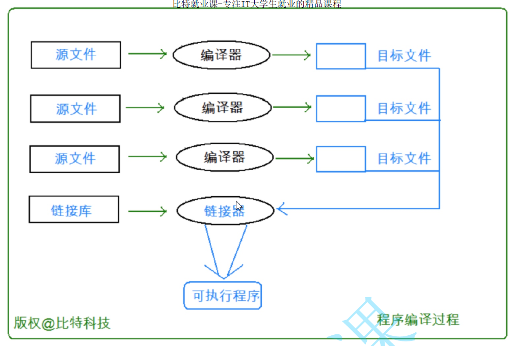

[toc]

## 程序编译过程

### 翻译环境

- 定义：.c 源文件通过一系列 预处理、编译、链接等操作 生产 .exe (Windows下)可执行程序的过程；

### 运行环境

- 定义：可执行程序运行需要的一系列操作





#### 编译器

- 组成一个工程程序的每个源文件通过编译过程都会分别转换成目标代码

#### 链接器

- 链接器同时也会引入标准C函数库中**任何被该程序所用到的函数**，而且它可以搜索程序员**个人的程序库**，将其需要的函数也链接到程序中；
- 链接器（linker）将每个目标文件捆绑在一起，结合 标准C函数库 中**任何被该程序所用到的函数**和程序员**个人的程序库**形成一个单一而完整的可执行程序


### 预处理语法

#### 预定义符号

- C 自身内部已经预定义的符号

```C
printf("%s\n", __FILE__); // 当前源文件在系统中的绝对路径地址
printf("%d\n",__LINE__);  // 本段代码所在的行号
printf("%s\n",__DATE__);  // 当前日期 月日年
printf("%s\n",__TIME__);  // 当前时间 时分秒
printf("%s\n",__FUNCTION__);  // 当前 函数名

__STDC__ //如果编译器遵循ANSI C，其值为1，否则未定义
printf("%d\n",__STDC__);
```


### 预处理指令

- #开头的指令都是预处理指令

```c
#define
#include

// 其他
#if
#endif
#ifdef
#line
#pragma pack(4)
#pragma
```


#### #define

- 语法：

  - ```c
    #define name stuff // stuff 可以是多种格式
    // #define MAX 100
    // #define STR "haha"
    // #define 
    ```

    
