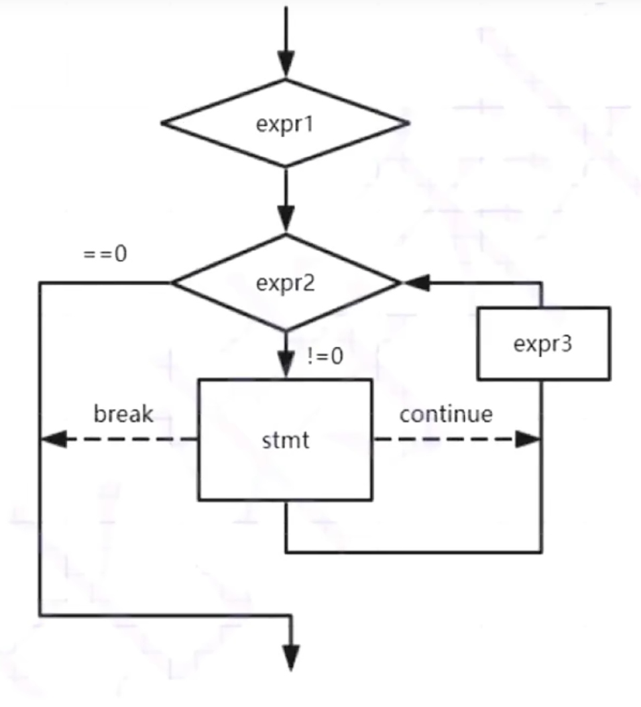
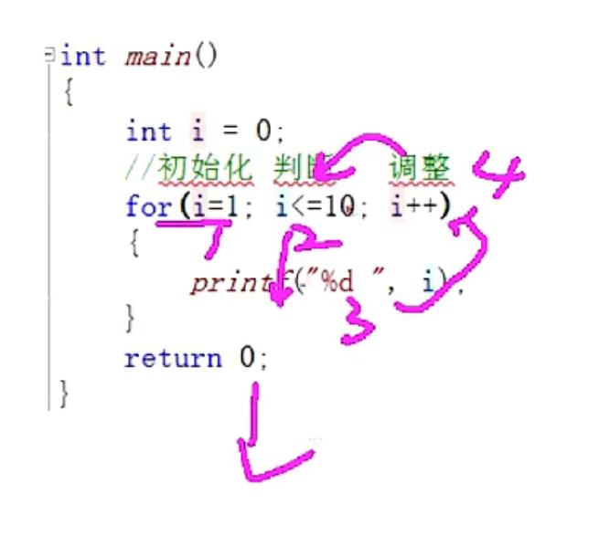
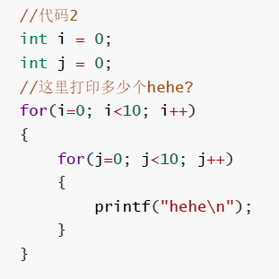
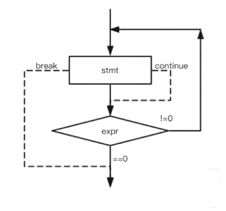

## 循环语句

### while 循环
- 定义：
```C
while(判断条件)
循环语句;
```
- 可以循环内部使用 break，当遇到它时直接跳出，且跳出最里面while循环结构
- 也可以使用 continue忽略本次循环continue语句后其他的循环语句，直接开始下一次迭代，处于嵌套结构中时，仅仅影响包含他的最里面循环结构

### for 循环
- for 循环的定义
 
```C
for(表达式1; 表达式2; 表达式3)
    循环语句；//多条语句时，必须使用{}包裹起来

表达式1：初始化部分，初始化循环变量
表达式2：条件判断部分，判断循环终止
表达式3：调整部分，用于循环条件的调整
```
- 对比 while 循环，for 循环()内部的三个表达式可以将 while 循环中多个表达式集中使用，更加直观、便捷
- for 循环执行流程
  - 
  - 

- break, continue 使用方法同 while 循环
- 使用建议：
  - 不可在 for 循环体内修改循环变量，防止 for 循环失去控制
  - 建议for循环内部表达式的循环变量取值采用**前闭后开区间**的写法
  - 即i = 0,前闭；i<5不等于5,后开；此时5的实际意义是循5次

- for 循环的变种：
  - for 循环的初始化、判断、调整三个表达式都可以省略，只要语句结束符号";"带上就可以
  - 判断表达式如果省略的话，判断条件恒为真 
- 变种1：因为省略j的初始化，导致j = 10判断不通过，只能执行i = 0的10次j打印
  - 
- 变种2：for循环表达式内部两个循环变量的使用


```C
int x, y;
for (x = 0, y = 0; x<2 && y<5; ++x, y++)
{
    printf("hehe\n");
}
```

- eg. 判断循环几次，注意判断语句和赋值语句的差异，特别是 == 和 =
```C
#include <stdio.h>
int main()
{
    int i = 0;
    int k = 0;
    for(i =0,k=0; k=0; i++,k++)
      k++;
    return 0;
}
// 判断表达式k = 0 是赋值语句，非判断语句，k==0为假，循环不执行

```

### do while 循环

```C
do
  statement;
while(expr); //注意while 后面有";"号,循环结束。
```
- 执行流程
  - 先做再判断，至少执行statement一次
  - while 后面无语句
  - 