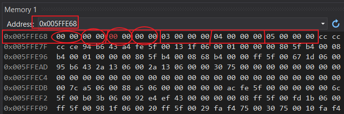

## 存储

### 二进制-十六进制

- 32bit系统 1的表示方法：
  - 十六进制表示时：0x00000001 一般省略表示为0x1
  - 二进制表示时：0000 0000 0000 0000 0000 0000 0000 0001

### 变量类型
- 类型的意义
  - 使用该类型开辟空间的大小；
  - 如何看待内存空间的视角
- 整型（类型大小 存放在 vs 软件 limits.h 头文件中）
  - int 的原型是 signed int, 一般不写signed 默认是有符号整型, 32位系统 int 大小 4byte
  - 无符号整型 unsigned int a = 2; 两个无符号数 + - 运算结果仍为无符号数 > 0
  - char 类型1byte 8bit, 也可以被singed, unsigned 关键字修饰
  - signed char 与 unsigned char 取值范围(补码 -> 原码 -> 十进制)
    - signed char:(补码)   00000000 00000001 ... 01111111 100000000 10000001 10000010 ... 11111101 1111110 11111111
    - 原码                 00000000 00000001 ... 01111111 特殊对待   11111111 11111110 ... 10000011 1000010 10000001
    - 十进制               0         1       ...  127      -128      -127     -126     ... -3       -2      -1
    - 100000000 特殊对待，直接被翻译为 -128;
      - 可以这样考虑助于理解，内部如何运行不知道：1 10000000(补码) -1, 1 01111111(反码)，110000000(原码) -128
    - -129 在char 中如何表示：-128-1
      - -128       10000000(补码)，
      -   -1       11111111(补码)
      - -128+(-1) 101111111, 截断低 8bit 01111111，最高位为0，正数，补码即原码
      - -129 表示为 127
    - unsigned char:(补码) 00000000 00000001 ... 01111111 100000000  10000001 10000010 ... 11111101 1111110 11111111
	- 原码 = 补码          00000000 00000001 ... 01111111  100000000  10000001 10000010 ... 11111101 1111110 11111111
	- 十进制               0        1        ... 127       128        129      130      ... 253      254      255
	- 255+1 = ?
    	-  11111111
    	-  00000001
    	- 100000000
    	- 截断低8bit 00000000 结果为0

    - 

  - 短整型 short int a = 2; a 至少2个字节长度，不大于int, 也可以被singed, unsigned 关键字修饰，signed short int a = 2; 一般只写short a = 2; 即可，32位系统short 大小 2byte
  - 长整型 long int a =2;不小于int 长度，至少4个字节长度，也可以被singed, unsigned 关键字修饰，signed long int a = 2; 一般只写 long a = 2;即可
  - 局部变量 auto int a=2; auto 一般默认不写；
  - 寄存器变量 register int a=2; 因寄存器数量有限，建议定义，一般不定义，定义后具体是否使用看编译器；
  
- 浮点型
  - fload 大小 4byte, 单精度浮点型
  - double 大小 8byte, 双精度浮点型
  - long doubl
> IEEE 754 规定：
> 
> 1. 对于 32 位的浮点数，最高的1位是符号位 S，接着的 8 位是指数E，剩下的 23 位为有效数字M
> 2. 对于 64 位的浮点数，最高的1位是符号位 S，接着的 11 位是指数E，剩下的 52 位为有效数字M
> 		
> 
> 
> 
> 根据国际标准IEEE（电气和电子工程协会） 754，任意一个二进制浮点数 V 可以表示成下面的形式:
> 
> - (-1)^S * M * 2^E
> 
> - (-1)^S 表示符号位，当S=0，V为正数；当S=1，V为负数
> 
> - M 表示有效数字，大于等于1，小于2
>> 1≤M<2, M 可以写成 1.xxxxxx 的二进制形式，其中 xxxxxx 表示小数部分，
>> 内存保存 M 时，默认这个数的第一位总是 1，因此可以被舍去，只保存后面的 xxxxxx 部分，等到读取的时候，再把第一位的1加上去(排除 E全为0或者全为1)；
>>
>> 例如：
>>
>> 保存1.01的时候，只保存01，等到读取的时候，再把第一位的1加上去。
> 
> - 2^E, E 表示指数，是一个无符号整数（unsigned int）
>> **存入内存时**，E 的**真实值**必须再加上一个**偏置值 2^(n-1)-1** 作为**计算值**存入内存
>> 
>>> 对于8位的 E，这个偏置值是127（2^7-1)
>> 
>>> 对于11位的 E，这个偏置值是1023(2^10-1)
>>
>>> 例如:
>> 
>>> 2^10 的 E 是10，所以保存成32位浮点数时，必须保存成10+127=137，即 10001001
>> 
>> **从内存中取出时**
>> 
>>> E不全为1或0时, E 的**计算值**必须再减去一个**偏置值 2^(n-1)-1** 得到真实值 
>>
>>>> 例如：真实值 0.5, 存入情况为：0 01111110 0000000000000000000000, E计算值（8bit） = 01111110，E真实值 = 126 - 127 = -1 
>>
>>>> s=0, m=0, e=-1, (-1)^0\*1.0\*2^(-1) = 1\*1.0\*0.5 = 0.5
>
>>> E全为0时，规定 E 真实值 = 1 - 127，且有效数字 M 不再加上第一位的1，原值还原为二进制$\pm 0.xxxxxx$无限趋近与0的很小数字
>>
>>> E全为1时，如果有效数字M全为0，表示±无穷大（正负取决于符号位s）；
> 
> 示例：存入内存
> 
> 1. 十进制的5.5，写成二进制是101.1 ，相当于1.011×2^2; S=0, M=011, E=2+127 = 10000001, 0 10000001 01100000000000000000000
> 2. 十进制的-5.5，写成二进制是-101.1 ，相当于-1.011×2^2; S=1, M=011, E=2+127 = 10000001, 1 10000001 01100000000000000000000
>
```C

// 例1
int main()
{
	float f = 5.5; // 4byte

	// 浮点数如何存放到内存 IEEE-754
	// f = 5.5 -> 二进制
	// 101.1 (1*2^2 + 1*2^1 + 1*2^0 + 1*2^(-1) = 4+1+0.5 = 5.5)
	// 1. 符号位判断；5.5 是正值 >0 最高位 S = 0
	// 2. 有效数字M; 101.1 = 1.011 * 2^2, M = 011
	// 3. 指数E:8bit; 2^2, E = 2 + 127 = 129 = 10000001
	// 存入内存为：0 10000001 01100000000000000000000B = 0100 0000 1011 0000 0000 0000 0000 0000B = 0x40b00000H

	printf("%f", f);
	// 内存取值：
	// 5.5 -> 0100 0000 1011 0000 0000 0000 0000 0000B = 0 10000001 01100000000000000000000B
	// s = 0，正数；有效数字M = 1.011; 指数E = 129 -127 = 2
	// 1.011*2^2 = 101.1 = 5.500000

	return 0;
}

// 例2
int main()
{
	int n = 9; //内存中补码为: 00000000 00000000 00000000 00001001
	float* pFloat = (float*)&n; // 不会对n的值形成改变
	// 指针的意义：
	// 1. int *p = NULL; p+1 能移动几个地址
	// 2. *p * 解引用操作可以操作几个字节
	printf("n的值为：%d\n", n);
	printf("*pFloat的值为：%f\n", *pFloat);
	// *pFloat 操作 是 把内存中的补码当作浮点型来操作
	// 00000000 00000000 00000000 00001001 = 0 00000000 00000000000000000001001
	// E为全0；(-1)^0 * 0.00000000000000000001001 * 2^(1-127) 
	// 2^-126 相当于0. 的小数点向左移动126位，每移动一位是一个bit, 此时. 后面的才为小数位，%f 打印4byte, 0. 后面有3byte，24bit, 所以此时打印为0.000000

	*pFloat = 9.0;
	printf("num的值为：%d\n", n);
	// 9.0 -> 1001.0 -> 1.001*2^3 = (-1)^0 * 1.001 * 2^3, s =0, M = 001, E = 3+127 = 130 = 10000010
	// 0 10000010 00100000000000000000000
	// %d 有符号整型输出，最高位 =0 值为正，补码即为原码，0100 0001 0001 0000 0000 0000 0000 0000 -> 1091567616
	printf("*pFloat的值为：%f\n", *pFloat); // 9.000000
	return 0;
}

```

- 构造类型
  - 数组类型
    - 数组类型: 由 元素类型 和 元素个数 共同决定
    - int array[10] 
      - 数组类型是 int [10], 其中 int 是元素类型，[10] 是元素个数
      - 对于数组变量的定义，通常将变量名放在数组类型之后，int [10] array, 但是为了看着舒服，因此规定定义方式为: int array[10];
    - 优先级: 小括号 () > 中括号 [] > 解引用 * ，它们的结合方向都是自左向右
      - 指针数组：int* array[10] = NULL; [] 的优先级高于 \*，所以 array 先与[]结合构成数组，数组内存放的元素是int* 指针；
        - 指针数组类型：int* [10]
        - 数组中存放的10个元素的类型为 int* 指针；
        - 指针指向 int 类型
      - 数组指针: int (*array)[10], 因为\* 的优先级高于[], 所以使用()提升优先级
    	- *array 是指针，int [10]是数组类型，无数组名。
        - 含义：指针 array 指向一个大小为10个整型的数组;
        - 用处：二维及以上维度数组arr[3][5]，数组名作为参数使用，数组名 arr 即为二维数组首元素的地址；二维数组 arr[3][5] 是由 3个 一维数组组成, 见下面的练习

	  - 分析代码含义：int (*p[10])[5]
    	  - ()优先级高，[] 优先级 高于*，p[10] 是数组，
    	  - *p[10]是指针数组，数组内部10个元素存放的是（数组）指针；
    	  - int [5] 是数组类型，
    	  - *p[10]指针数组 中数组存放的指针是int [5] 数组类型的数组名
    	  - 汇总：数组指针数组 int [5] -> * -> p[10]

	  
	
	[数组名是什么](../Array/array.md/#数组名是什么)

	```C
	int main()
	{
		int arr[10] = { 0, 1, 2 };
		// arr 首元素地址
		// &arr[0] 首元素地址
		// &arr 数组地址
		
		char* arr0[10]; // 指针数组 本质是存放指针的数组

		// 如何将 arr0 数组地址 放到变量pa中？
		// 1. arr0 是数组地址，必须放到数组指针中
		// (*pa)
		// 2. char* arr0[10] 是指针数组，指针数组类型是 char* [10]
		char* (*pa)[10] = &arr0;

		int arr1[] = { 1,2,3,4,5 };
		int arr2[] = { 2,3,4,5,6 };
		int arr3[] = { 3,4,5,6,7 };

		int* parr[] = { arr1, arr2, arr3 }; // 指针数组，[] 优先级高于 *，从左往右结合，parr先与[]结合，构成数组parr[], 数组中元素的类型是 int* 指针；指针指向类型是 int
											// 指针数组类型：int* []
		int(*arrp)[10] = &arr; // 写代码时，一般很少这样用
		// 对指针 arrp 解引用操作，*arrp就是arr, 是数组arr[10]的数组名 
		// (*arrp)[0] =  0, (*arrp)[1] =  1
		// *(*arrp+1) = 1

		}

        ///////////////////
		// 数组指针的应用 //
		//////////////////

		// arr 存放数组地址，即第一行 一维数组 地址，数组地址即为首元素地址
		void print_arr2(int(*arr)[5], int row, int col) 
		{
			int i = 0;
			for (i = 0; i < row; i++) // 每行
			{
				int j = 0;
				for (j = 0; j < col; j++)
				{
					printf("%d ", *(arr[i]+j));

					printf("%d ", *(*(arr+i)+j)); 
					// arr + i 取得每行一维数组 地址； *(arr+i) 取得数组名；*(arr+i)+j 数组名即为首元素地址， +j 向后移动，遍历数组中 j 元素；*(*(arr+i)+j) 对 j 元素解引用；
					printf("%d ", (*(arr + i))[j]); 
					// *(arr+i) 取得数组名; *(arr+i)[j] 根据数组名拿内部元素，因为[]优先级比*高，(arr+i)[j]的结合影响了 *(arr+i) 取数组名，所以使用()提升优先级，(*(arr + i))[j]
				}
				printf("\n");
			}
		}

	```

	

  - 结构体类型 struct
    - [详细](../Structure/structure.md)
  - 枚举类型 enum
  - 联合类型 union
- 指针类型
  - int* p
  - char* p
  - float* p
  - void* p
    - 无类型指针, void代表无类型
    - void* 指针可以接收任意类型的变量地址，如：int, char, double, struct等
    - void* 类型的指针**不能直接进行解引用操作**，**不能直接进行 + - 整数的运算**，因为指针的这两种操作是**需要明确知道类型所占字节大小**的
    - **不能直接对某种类型指针赋值**，赋值运算 "=" 左右两侧的值类型必须一致，不然需要强制转换
    - 当需要操作 void* 定义的指针时，可以对指针进行强制转换
	
	```C

	int main()
	{
		char ch = 'w'
		int a = 10;
		void* p = &a;
		p = &ch;

		// *p = 0;
		// p++;
		// 以上两个操作是错误的，因为指针需要明确知道类型所占字节大小才能 + - 操作，而 p 指针是 void 类型，故无法操作，可以对p 强制类型转换即可
	}

	```

  - int (*p)[5] // 数组指针 - 指向数组类型 int [5] 的指针
  - int (*p)(int a, int b, ...) // 函数指针 - 指向函数类型 int (int a, int b, ...) 的指针
- 空类型 无返回值
  - void: 函数返回类型
    - void func()
  - 函数的参数
    - void func(void)

### 类型重命名: typedef 关键字
[typedef](../KeyWord/keyword.md/#typedef-类型重命名)

### 宏定义 define
[宏定义 define](../KeyWord/keyword.md/#define-宏定义)

### 变量生命周期

- 变量的生命周期：指的是变量的创建到变量的销毁之间的一个时间段
- 局部变量的生命周期是：进入作用域生命周期开始，出作用域生命周期结束
- 全局变量的生命周期是：整个程序的生命周期

### 变量、作用域 static extern

- 局部变量（函数入口形参、函数内部、代码块{}内部使用的变量）是在在栈区开辟的内存，作用域是变量所在的区域的局部范围，如{}内部定义并使用的变量，出{}后作用域失效；
	```C

	for(int i = 0; i<10; i++)
	{
		// 局部变量 i 在栈区开辟的内存，作用域只在 { } 内部使用，出括号{}后 i 将不起作用
	}

	```

- 局部变量默认都是自动变量，如: auto int a = 10; 一般不写auto关键字
- **局部数组存放位置?**
- 栈区 开辟内存的 局部变量 就是临时变量，使用完毕后（比如调用函数中的变量，函数结束后）该内存中我们自己放的内容就会被自动销毁，然后由其他函数安排，如果继续使用指向该内存的指针则会根据编译器的不同 返回随机值 或者 程序崩溃
- 堆区 开辟的动态内存，必须使用free函数才可以销毁

	```C

	int* test()
	{
    	int a = 10; 
    	return &a; // 返回 栈区 空间地址，非法访问
	}

	int* test()
	{
    	static int a = 10; // 将 a 由栈区 放到 静态区，a的空间在函数调用后不会被释放，仍可使用
    	return &a; // 静态区
	} 

	int* test()
	{
    	int* ptr = malloc(100); // ptr指针的地址指向 堆区，必须使用 free(ptr) 才可以被释放，否则会内存泄漏，不同于栈区的调用完自动释放
    	return ptr; // 堆区
	}

	```

- static（翻译：静态的）关键字，修饰局部变量，改变了局部变量的生命周期，本质上是改变了变量的存储类型，从栈区到静态区
- static 修饰全局变量，使得这个**全局变量**只能在自己所在的源文件.c内部可以使用，其他源文件**不能**使用
- static 修饰函数，改变了函数的链接属性，使得函数具有的外部链接属性被修改为内部链接属性，只能在自己所在的源文件内部使用，不能在其他源文件内部使用
- static 修饰全局变量和函数，本质上：static 是将全局变量和函数的外部链接属性变成了内部链接属性

- 全局变量的作用域可在使用前通过 **extern**（翻译：外部的）关键字声明，作用于整个工程中的任意一个 .c 源文件
  - 全局变量，在其他源文件内部通过 extern 关键字声明可以被使用，是因为全局变量具有外部链接属性
  - 但是被 static 修饰之后，就变成了内部链接属性，其他源文件就不能链接到这个静态的全局变量了
  - 全局变量不初始化，默认是0；

- 全局变量定义后，再次被局部变量定义的话，局部变量优先使用
- **区分 static 修饰局部变量是改变生命周期，修饰全局变量和函数是改变外部链接属性为内部链接属性**


### 栈区的使用

- 函数中局部变量i、arr都是局部变量，局部变量值都存储在栈区上
- 函数中 形参 也是存储在栈区
- 函数调用也是在栈区申请空间
  - 当函数传入的参数不是地址时，形参需要对实参一份临时拷贝，因为临时变量存储在栈区，栈区增加元素只能从顶上增加，所以形参对实参一份临时拷贝是压栈操作
- 栈区空间的使用：
  - 栈区插入元素，只能从顶上增加 - 压栈，顶上删除元素 - 出栈
    - 所以**先进的后出**，**后进的先出**
  - 先使用栈区高地址处的空间再使用低地址处的空间
  - **栈区存储数组**的话，也尊寻**随着下标的增长地址是由低到高变化**
- 数组如果合适的往后越界的话，就有可能在越界的过程中遇到i或者其他局部变量；
- 当改变数组元素时，就有可能改变i或者其他局部变量的值，出现死循环或者其他奇怪的问题
- 栈区被使用完后就会抛出错误，StackOverflow 栈溢出
- 不同编译平台，相邻的两个局部变量存储地址间隔不同
  - linux平台，gcc编译器：间隔一个地址
  - vc6.0 编译器：紧挨着无间隔
  - vs2013编译器：间隔两个地址


```C

// 栈区越址访问
int main()
{
    int i = 0;
    int arr[10] = {1,2,3,4,5,6,7,8,9,10};
    for(i=0;i<=12;i++)  //将会导致arr数组寻址错误，访问越界
    {
        printf("arr[i]=0\n");
        arr[i] = 0;
        printf("arr[i] = %d\n",arr[i]);
    } //i=12,for循环中最后一个arr[i]=0;执行后，i=0，下个语句，i++,i=1,此时会陷入死循环；
      //可能的原因是：i和arr[12]同一个地址，为什么会是同一个地址呢？
      //

    system("pause");

    return 0;
}

```

### 动态内存管理与分配

- 


### 计算机存储结构
- 寄存器关键字 register
- 因为cpu计算速度跟内存读写速度不匹配，在cpu和内存之间加入读取速度更快的高速缓存和寄存器
- 当为了高速访问变量时，可以将变量定义寄存器变量，如: register int a; 因为寄存器数量有限，只是**建议**这样定义，一般不定义


### 如何产生存储地址(假设32位系统，按字节byte进行编址)
- 地址是连续的
- 内存 = 末地址 - 首地址 + 1
- 2^32二进制表示为 1*2^32，33个二进制数，由1个1和32个0组成，假设首地址是0，则末地址 = 内存 -1 = 2^32 -1,使用2进制计算得到首位一个0和32个1，16进制表示则为0xffffffff
- 32根地址线，每根地址线有0,1两种状态代表电平高低，二进制数 从 000...000(32位) 到 111...111(32位) ，一共有2^32个存储地址,范围从0-0xffffffff
- 每个地址（按字节进行编址）表示一个存储单元的位置，所以存储单元的个数也为2^32个
- 存储容量 = 存储单元 * 8bit


### 整数(整型)在计算机内存中存储形式

- 正数（包括无符号数）在内存中存储的是二进制的 ** 原码 **，因为 原码 = 反码 = 补码
- 二进制数最高位为符号位，负数为 1，正数为0；
- 原码：直接将该整数按照正负数的二进制形式翻译过来即可；
- 负数在内存中存储的是二进制的 ** 补码 **
  - 负数的原码：最高位符号位为 1，其他位获得同正数原码
  - 负数的反码：符号位不变，其他位按位取反
  - 补码 = 反码 + 1
  - printf("%d\n",b), b在内存中存储的是补码，打印的是 b 的原码
  - char a = 0xb6; short a = 0xb600; int a = 0xb6000000
    - 内存中存放的是 0xb6, 0xb600, 0xb6000000
    - 没有十进制 -> 二进制转化中最高位符号位、原码 反码 补码的运算和注意
    - 把它们当作十进制已经转化好的二进制即可，只是用16进制表现而已

```C

-1
10000001 原码
11111110 反码
11111111 补码

16
00010000 原码
00010000 反码
00010000 补码

2^8 = 256
2^10 = 1024

```


### 存储的大小端问题（讨论字节顺序的问题）
- 小端（存储）模式，指数据的低位，保存在内存的低地址中，而数据的高位，保存在内存的高地址中
- 大端（存储）模式指数据的低位，保存在内存的高地址中， 而数据的高位，保存在内存的低地址中
  - 数据低位：当整形数据为 0x11223344, 0x44即为数据低位，0x11为数据高位
  - 低地址：当 0x000000c8 为一地址，0x000000c8 即为低地址，因为地址是连续的，后续为0x000000c9 0x000000ca 0x000000cb...
```C

// 1byte 8bit 数据占一个内存地址, 假设整形数据 0x11223344，内存指向地址为0x000000c8
// 小端（存储）模式：
// 0x000000c8 0x44
// 0x000000c9 0x33
// 0x000000ca 0x22
// 0x000000cb 0x11

int a = 1;
char* p = (char*)&a; // 将 &a 指向 int 类型强制转化为指向 char 类型，虽然 a 是int 类型，4byte, 但是拿值时是 从低字节开始，1byte 1byte 的拿

```
- 我们常用的 X86 架构小端模式，而KEIL C51 则为大端模式。
- 很多的ARM，DSP都为小端模式。
- 有些ARM处理器还可以由硬件来选择是大端模式还是小端模式

### 变量类型强制转换

- [指针类型的意义](../Pointer/pointer.md/#指针类型的意义)

```C

void srand(unsigned seed);    //seed 必须是时刻变化的量，unsigned类型，可以使用时间戳代替，使用time函数获取时间戳

time_t time(time_t* const timer);  //函数包含在 time.h,time函数返回值类型是time_t，右键查看定义，time_t类型是使用typedef 重命名的long型

srand((unsigned) time(NULL));  //调用一次即可
//time函数返回值类型与srand函数输入参数类型不同，强制转换,类型使用括号包裹；
//time函数输如参数为指针类型，防止空指针，初始化为NULL
```


#### 函数指针

```C

// 示例1：函数指针 强制类型转换
1. 函数指针的声明形式：void (*pFunction)()

2. 没参数的情况下可写成 void (*pFunction)(void) 的形式

3. pFunction 函数指针原型: void (*)(void)

// 对于一个给定的 entry 地址，要把它转换成为函数指针，就是
(void (*) (void))entry

- 对于函数指针的调用，ANSI C 认为 pFunction () 和 * pFunction () 都是正确的
- 所以 ((void (*) (void))(entry)() 就形成一个地址为 entry 的函数调用


// 示例2: 将 地址0 强制类型转化 函数指针，并调用该(地址为0)函数: (\*(void(*)())0)();

void(*)()
// 返回类型为void 、无形参的函数指针类型；

(void(*)())0 
// 对地址 0 强制转化为函数指针
// 0 默认是int 型，使用函数指针类型 void (*)() 强制类型转化 0 为一个函数的地址，该函数 是无返回值、无形参的

*(void(*)())0
// 解引用操作, 拿到函数地址为 0 的函数名  
// 为什么 不写成 *((void(*)())0) 也可以？
	// 因为 (void(*)()) 是类型强制转换，自右向左结合，(void(\*)())先与 0结合；\* 解引用操作，优先级靠后，也是自右向左结合，所以可以写成 *(void(\*)())0

(*(void (*)())0)()
// 函数的调用，无实参
// 也可以省略掉解引用操作 (void (*)())(0)()

```

### 类型强制转换后 指针 + - 操作过程

- arr数组地址及其存储的值


- p指针地址指向arr数组的地址，第一次操作，01变为00


- p指针地址指向arr数组的地址，第三次操作,02变为00




```C
连续读取0x03 0x02，

char* p5 = &num; // num = 0x01020304; p5 存放num的地址，*p5 = 0x01020304；小端存放形式为04030201
p5++; // 地址每加1向右移动一个字节；指向03的地址
p5 = (short*) p5; //将 p5, char类型指针强制转换为指向类型为short两个字节且自身类型为short*的类型；起始地址指向03的地址
printf("*p5 = %#x\n", *p5); //起始地址指向03的地址，1次读取一个short 长度的值，读取的结果为 0302，从小端存储 打印出来是0x0203

//定义p5指针变量char 1个字节类型，char* p5, 每次+1可以取一个，p5+1 地址指向0x03值的地址, 使用*(short*)p5 将p5强制转换为指向类型为short 两个字节，自身类型为short*的类型，进而读出0x03 0x02
```


```C

int main()
{
	int arr[] = { 1, 2, 3, 4, 5 }; // arr数组地址即为首元素地址 0x005ffe68, arr[0] 用16进制表示, 小端存储, 为0x01000000, 4个字节
	                               // arr[1]内存地址为 0x005ffe6b, arr[1] = 0x02000000,
	short* p = (short*)arr; //强制转换为 short*类型指针, p指针存储 short 类型 arr 数组地址0x005ffe68, 在该地址上操作存储的值
	int i = 0;
	for (i = 0; i < 4; i++)  
	{
		*(p + i) = 0; //i = 0, 第一次操作arr[0] 中0100；
                      //i = 1, 第二次操作arr[0] 中0000；
                      //i = 2, 第三次操作arr[1] 中0200
	}

	for (i = 0; i < 5; i++)
	{
		printf("%d ", arr[i]);
	}
	return 0;
}

```

### 整型提升/隐式转化
- [整型提升/隐式转化](../Operator/operators.md/#整形提升隐式转换)

```C

//
int main()
{
	char a = -1;
	signed char b = -1;
	unsigned char c = -1;
	// c 二进制 -1
	// 10000000000000000000000000000001 原码
	// 11111111111111111111111111111110 反码
	// 11111111111111111111111111111111 补码
	// 整型截断
	// unsigned char c 11111111
	printf("a=%d,b=%d,c=%d", a, b, c);
	// c = %d
	// 1, 整型提升 unsigned char -> int 
	// 11111111 -> 00000000000000000000000011111111 补码
	// 2, 补码 -> 原码 转换
	// %d 有符号十进制 输出，根据补码的符号位进行 补码 -> 原码 转换，输出原码
	// 3, 原码二进制 -> 十进制
	// 
}

//
int main()
{
	char a = -128;
	// a       10000000000000000000000010000000 原码
	//         11111111111111111111111101111111 反码
	//         11111111111111111111111110000000 补码
	// 整型截断 char a  10000000
	printf("%u\n", a);
	// 1, 整型提升 char -> int 
	// 10000000 -> 11111111111111111111111110000000 补码
	// 2, 补码 -> 原码 转换
	// %d 有符号十进制整型 输出，正常是根据补码的符号位进行 补码 -> 原码 转换，输出原码，
	// 但是 %u 无符号十进制整型 输出的话，默认整型提升后的补码最高位不是符号位，是无符号数，原码 反码 补码 三码相同，无需转换
	// 3, 无符号二进制 -> 十进制 
	// 11111111111111111111111110000000 -> 4294967168
	return 0;
}

//
int main()
{
	char a = 128;
	// char 最大127
	// 128 10000000000000000000000010000000 原码
	// 整型截断 char a, 1000 0000
	printf("%u\n",a); // 整型提升 int a, 11111111 11111111 11111111 10000000
	                  // %u 打印 最高位符号位表示大小

	return 0;         
}

// 输出多少
int i= -20;
unsigned int j = 10;
printf("%d\n", i+j); // 按照补码的形式进行运算，最后格式化成为有符号整数

// 输出多少 9 8 7 6 5 4 3 2 1 0 死循环
unsigned int i;
for(i = 9; i >= 0; i--)
{
printf("%u\n",i);// i = -1时，因为 i 是 unsigned char，-1 补码 -> %u 符号位 1 表示大小
}

// 打印为255
int main()
{
	char a[1000]; //char 类型大小  0 1 ... 127 -128 ... -1
	int i;
	for (i = 0; i < 1000; i++)
	{
		a[i] = -1 - i; // a[1000] ={-1, -2, -3, ... -127, -128, 127, 126, ... 2, 1, 0, -1,  } // -129 在char类型中对应 127
	}
	printf("%d", strlen(a)); // strlen()函数遇到 0 停止运行计数，所以结果是255

	return 0;
}

// 255 + 1 = 0, 程序死循环
unsigned char i = 0;
int main()
{
for(i = 0;i<=255;i++) // 255 + 1 = 0, 程序死循环
{
printf("hello world\n");
}
return 0;
}

```