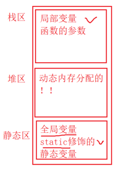
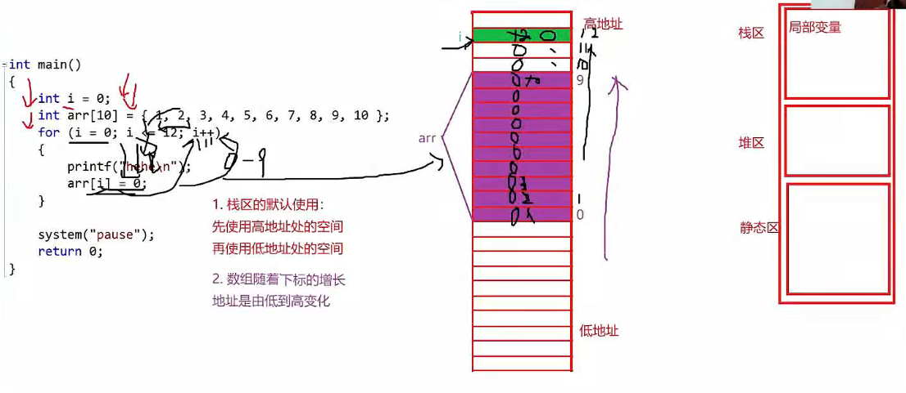

## 存储

### 变量的定义（关键字修饰）
- int 的原型是 signed int, 一般不写signed，是有符号整型
- 无符号整型 unsigned int a = 2; 
- char 类型一个字节8bit,也可以被singed unsigned 关键字修饰
- 局部变量 auto int a=2; auto 一般默认不写；
- 寄存器变量 register int a=2; 因寄存器数量有限，建议定义，一般不定义，定义后具体是否使用看编译器；
- 短整型 short int a = 2; a 至少2个字节长度，不大于int,一般只写short a = 2;即可
- 长整型 long int a =2;不小于int 长度，至少4个字节长度，一般写作 long a = 2;即可
- 类型定义 typedef 关键字
  - 类型重命名
  - 使用方法：typedef 类型定义 类型重定义
    - typedef unsigned int u_int;
    - e.g: unsigned int a = 10;等价于 u_int a = 10;

### 变量作用域

- 局部变量（函数内部、代码块{}内部使用的变量）的作用域是变量所在的区域的局部范围，如{}内部定义并使用的变量，出{}后作用域失效；
- 局部变量默认都是自动变量，如: auto int a = 10; 一般不写auto关键字

- static（翻译：静态的）关键字，修饰局部变量，改变了局部变量的生命周期，本质上是改变了变量的存储类型
- static修饰全局变量，使得这个**全局变量**只能在自己所在的源文件.c内部可以使用，其他源文件**不能**使用
- static 修饰函数，改变了函数的链接属性，使得函数具有的外部链接属性被修改为内部链接属性，只能在自己所在的源文件内部使用，不能在其他源文件内部使用

- 全局变量（函数内部、代码块{}外部使用的变量）的作用域可在使用前通过extern（翻译：外部的）关键字声明，作用于整个工程中的任意一个.c源文件
  - 全局变量，在其他源文件内部通过extern关键字声明可以被使用，是因为全局变量具有外部链接属性
  - 但是被 static 修饰之后，就变成了内部链接属性，其他源文件就不能链接到这个静态的全局变量了
- static 本质上：static 是将函数的外部链接属性变成了内部链接属性

- 全局变量定义后，再次被局部变量定义的话，局部变量优先使用

### 变量生命周期

- 变量的生命周期：指的是变量的创建到变量的销毁之间的一个时间段
- 局部变量的生命周期是：进入作用域生命周期开始，出作用域生命周期结束
- 全局变量的生命周期是：整个程序的生命周期

### 栈区的使用

- 函数中局部变量i、arr都是局部变量，局部变量值都存储在栈区上
- 栈区空间的使用：
  - 先使用栈区高地址处的空间再使用低地址处的空间
  - 栈区存储数组的话，也尊寻随着下标的增长地址是由低到高变化
- 数组如果合适的往后越界的话，就有可能在越界的过程中遇到i或者其他局部变量；
- 当改变数组元素时，就有可能改变i或者其他局部变量的值，出现死循环或者其他奇怪的问题
- 不同编译平台，相邻的两个局部变量存储地址间隔不同
  - linux平台，gcc编译器：间隔一个地址
  - vc6.0 编译器：紧挨着无间隔
  - vs2013编译器：间隔两个地址

### 计算机存储结构
- 寄存器关键字 register
- 因为cpu计算速度跟内存读写速度不匹配，在cpu和内存之间加入读取速度更快的高速缓存和寄存器
- 当为了高速访问变量时，可以将变量定义寄存器变量，如: register int a; 因为寄存器数量有限，只是**建议**这样定义，一般不定义

