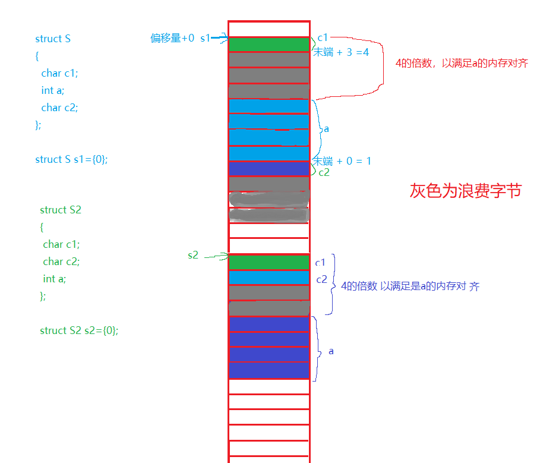

## 结构体

### 使用结构体关键字声明一个 结构名 类型的结构体：
- struct 标记 / 结构名 { };
  - struct 结构体关键字
  - 声明的结构体只是一个描述文件，不会开辟内存空间，只要使用成员变量时才会开辟内存空间
  - 声明结构
  - 结构体是一些值的集合，这些值称为成员变量
  - {}中存放 成员变量，结构的成员变量可以是标量、数组、指针，甚至是其他结构体
  - 可以多次使用标记定义 结构变量

### 使用结构体声明 定义结构变量
- struct 标记 / 结构名 { } 结构变量；
  - 声明结构 和 定义结构变量 一起使用
  - 此时 结构变量 是全局变量

```C

struct Stu //struct 结构体关键字；Stu 标记 / 结构名; struct Stu 结构体类型
{
    //成员变量
    char name[20];
    int age;
    char sex;
    char ID[19];
}s1, s2, s3; //该处的s1 s2 s3 是全局变量，编程应该尽量避免使用全局变量

struct Stu s4; // 使用Stu 结构体类型创建的 全局结构变量 s4;

int main()
{
    struct Stu s5; // s5 是使用Stu 结构创建的 局部结构体变量
}

```

### 定义结构变量不使用 标记 / 结构名 (匿名结构体类型)
- struct {} 结构变量;
  - 当声明结构 和 定义结构变量 合并一起的话，可以不需要使用标记 / 结构名
  - 因为无 标记 / 结构名，所以只能在定义结构体时定义一次全局结构变量
```C

struct
{
    char name[20];
    int age;
    char sex;
    char ID[19];
}s1; // 定义全局结构体变量s1, 因为没有标记名，该结构体变量只能在声明时定义

struct
{
    char name[20];
    int age;
    char sex;
    char ID[19];
}* s2; // 创建结构体指针变量 s2

s2 = &s1 // 可以这样赋值吗？不行，因为编译器 认为 s2 的类型和 &s1 的类型不一致

```

### 直接使用 标记名 定义 结构变量
- struct 标记 / 结构名 结构变量;
- 此时 结构变量 是局部变量

### 结构体的自引用
- 在结构中包含一个类型为该结构本身的成员

```C

struct Node
{

  int data;
  //struct Node next; // 错误定义，类似递归的方式，造成栈溢出
  struct Node* next; // 解决方法

};

// 匿名结构体的 typedef 别名
typedef struct
{
  int data;
  N                                           ode* next; // 错误定义，无标记名 的匿名结构体 typedef 别名，当前使用的别名 Node 仍未定义就拿来使用
}Node;

//解决方案：
typedef struct Node  // 标记名不省略
{                                                                                                                                                    
  int data;
  struct Node* next; // 完整定义 Node 结构体指针
}Node;

```

### 结构体初始化

- 使用结构体定义结构变量时，使用 {} 赋值初始化
  - struct 标记 / 结构名 结构变量 = { };

- 定义时，直接初始化(按照顺序)

```C

struct S
{
	int a;
	char c;
	char arr[20];
	double d;
}* s1 = NULL; // 定义时，直接初始化

struct T
{
	char ch[10];
	struct S s; // 结构体中定义 结构体
  struct T* next; // 结构体的自引用
	char* p;
}t1= {"haha", {10, 'z', "nihao", 6.18}, NULL, "hehe"}; // 定义时，直接初始化

char arr[] = "hello bit\n";
struct T t = { "hehe", {100, 'w', "hello world", 3.14}, NULL, arr}; // 定义时，直接初始化
struct T t2 = {0}; // 将 t2 结构体变量 中成员变量全部初始化为0；

```

- 定义时，直接初始化，乱序赋值(必须使用 .成员名)

```C

struct S s2 = {
	.d = 3.14159,
	.a = -10,
	.c = 'A',
	.arr = "nihao"
	}; // 定义时，乱序初始化

```

- 定义后，对结构变量成员单独进行赋值

```C
struct S s3 = {0};

s1= &s3;
s1->a = 5;
s1->d = 3.1415;
strcpy(s1->arr, "woyehao"); // 字符数组不接受直接将值赋值给它，它的值是初始化来的
s1->c = 'B';

struct S s4 = { 0 };
	s4.a = 13;
	strcpy(s4.arr, "jinwanxiaobaobao"); // s4.arr = "jinwanxiaobaobao"; 字符数组不接受直接将值赋值给它，它的值是初始化来的
	s4.c = 's';
	s4.d = 1.732;

```

### 结构变量成员操作

- 结构体变量 sb. 成员 访问结构体内部变量
- 结构体指针变量 sp-> 成员 访问结构体内部变量
  - 对成员是 "" 包裹、字符数组类型，使用 strspy() 函数操作，不能类似其他数组使用下标操作

```C

struct S s3 = { 0 };
	s1 = &s3; // s1为结构体指针
	s1->a = 5;
	s1->d = 3.1415;
	strcpy(s1->arr, "woyehao"); // 字符数组不接受直接将值赋值给它，它的值是初始化来的
	s1->c = 'B';
	printf("s1->arr = %s\n", s1->arr);

struct S s4 = { 0 };
	s4.a = 13;
	strcpy(s4.arr, "jinwanxiaobaobao"); // s4.arr = "jinwanxiaobaobao"; 字符数组不接受直接将值赋值给它，它的值是初始化来的
	s4.c = 's';
	s4.d = 1.732;

void print1(struct T tmp) // 结构体传参，tmp 是对传参变量数据的一份临时拷贝。
{
  printf("%s\n", tmp.ch);  // hehe
	printf("%s\n", tmp.s.arr); // hello world
	printf("%lf\n", tmp.s.d); // 3.14
	printf("%s", tmp.p); // hello bit，换行
}

void print2(struct T* tmp) // 结构体 传地址
{
	printf("%s\n", tmp->ch);  // hehe
	printf("%s\n", tmp->s.arr); // hello world
	printf("%lf\n", tmp->s.d); // 3.14
	printf("%s", tmp->p); // hello bit，换行
}


```

### 结构体内存对齐

- 原因：结构体的内存对齐是拿空间来换取时间的做法
  - 32bit机器 有32根地址线即32根数据线，所以一次拿 4byte, 如果不是按照每次拿 4byte 来计算的话，则至少需要2次来寻找数据
- 应用方法：
  - 设计结构体时，既要满足对齐，又要节省空间，应该让占用空间小的成员尽量集中在一起
- 内存分布情况：
  - 第一个结构体变量成员 在结构体变量地址 偏移量为0 的地址处
  - 其他结构体变量成员 要对齐到 对齐数 的整数倍的地址处(地址从上一个结构体成员地址起始端开始的)
    - 对齐数：编译器默认的一个对齐数 与 该变量成员 类型 大小 的较小值, min(默认对齐数，结构体变量成员 类型 大小（byte）)
      - char a[10] = {0}, a 字符数组成员的大小为 char 1byte，对齐数为 min(1,8) = 1;
      - vs 平台默认值为 8byte
      - gcc 平台无默认值，以结构体变量成员大小（byte）为准
  - 结构体 总大小为 除第一个结构体变量成员外（第一个结构体成员没有对齐数） 其他结构体变量成员的 最大对齐数 的整数倍
  - 如果嵌套了结构体的情况，嵌套的结构体对齐到自己内部的最大对齐数的整数倍处，结构体的整体大小就是所有最大对齐数（含嵌套结构体的对齐数）的整数倍
- 修改默认对齐数
  - #pragma 函数包裹的部分 默认对齐数 为自设置的
  
  ```C

  #pragma pack(8)  //设置默认对齐数为8
  struct S1
  {
    char c1;
    int i;
    char c2;
  };
  #pragma pack() //取消设置的默认对齐数，还原为默认

  ```




```C

struct S
{
	int a; // 4
	char c; // 1 1+4 = 5
	char arr[20]; // arr数组每个元素是char类型 1byte, min(1,8)=1; arr 之前存在 5byte 数据, arr 自身20byte, 5 + 20 = 25
	double d; // min(8,8) = 8；d 之前存在 25byte 数据; 3*8 < 25 < 4*8 = 32, 从arr 末端补充 7个byte，25+7 =32 是 8 的4倍，d自身大小为8byte, 32 + 8 = 40
}*s1 = NULL; // sizeof(struct S); 4 + 1 + 20 + 7 + 8 = 40, max(1,1,8) = 8, 总大小为8的倍数，所以是 5*8 = 40;

struct T
{
	char ch[10]; // 大小 10
	struct S s; // 结构体中定义 结构体，大小 40，min(8,40) = 8, 上个数组占据 10byte, 10+6 = 16 = 2*8, 所以补充6byte, 加上自身大小40，10 + 6 + 40 = 56
	char* p; // 大小 4byte，min(4,8) = 4, 4*14 = 56，从s开始不需要补，56 + 4 = 60
}; // sizeof(struct T); s 结构体内部最大对齐数为 double 类型的 8；max(8,4) = 8； 7*8 < 60 < 8*8, 所以大小为64byte

```

### 定义结构体指针

- struct 标记 / 结构名* 结构变量;
  - 定义结构体指针，结构变量自身类型为 struct 标记 / 结构名*，指针指向类型为 struct 标记 / 结构名

```C

// 定义结构变量指针//
struct Stu
{
    char name[20];
    short age;
    char sex;
    char phone[12];
}* s1; //使用结构体定义结构变量指针 s1

struct Tec
{
	int a;
	char c;
	char arr[20];
	double d;
}t;

struct Tec* t1 = NULL; 
t1 = &t;

```

### 结构体传参
- 结构体传参，形参 是对传入 实参结构变量数据 的一份临时拷贝，当数据比较大时，拷贝数据的内存压栈操作的系统开销较大
- 结构体 传地址，通过传入实参的 结构体地址 操作 实参结构变量成员数据，不会形成数据的临时拷贝而开辟内存空间，但是会通过地址修改原成员内容
  - 避免传址操作修改原成员内容，可以使用 const 关键字修饰 struct StrName* tmp，这里* tmp通过 \* 解引用，类型为结构体变量。
  - 整体形式为：const struct StrName* tmp, 这里 tmp 接收是指向结构体变量的地址，原结构体变量成员的值将不会被修改
- 推荐结构体传参 使用结构体地址

```C

struct S
{
	int a;
	char c;
	char arr[20];
	double d;
};

struct T
{
	char ch[10];
	struct S s; // 结构体中定义 结构体
	char* p;
};

void Init(struct S* ps)
{
  ps->a = 100;
  ps->c = 'A';
  ps->arr = "haha";
  ps->d = 3.14;

}

void print1(struct T tmp) // 结构体传参
{
	printf("%s\n", tmp.ch);  // hehe
	printf("%s\n", tmp.s.arr); // hello world
	printf("%lf\n", tmp.s.d); // 3.14
	printf("%s", tmp.p); // hello bit，换行
}

void print2(struct T* tmp) // 结构体 传地址
{
	printf("%s\n", tmp->ch);  // hehe
	printf("%s\n", tmp->s.arr); // hello world
	printf("%lf\n", tmp->s.d); // 3.14
	printf("%s", tmp->p); // hello bit，换行
}

int main()
{
	char arr[] = "hello bit\n"; // hello bit 换行
	struct T t = { "hehe", {100, 'w', "hello world", 3.14}, arr }; // 结构体初始化时，使用{}包裹，结构体中 结构体初始化仍然使用{}包裹
  
  struct S s1 = {0};
  Init(&s1);

  print1(t);
  print2(&t);

	return 0;
}

```

### typedef-类型重定义
- 为某一类型重命名
- typedef 的解释由编译器做出，不同于define的定义是预处理器执行
  - #define 3.14 Pi 
- typedef 定义 符号名称的对象 仅限于类型，无法操作数值
  - typedef unsigned char u8; 正确
  - typedef 8 eight; 错误
- 使用 typedef 命名结构体类型时，可以[省去标记名](#定义结构变量不使用-标记--结构名)
- 使用 typedef 重命名，并不是创建新的类型，它只是创建了一个便于使用的标签
- 使用 typedef 重定义的结构体在使用 标签定义结构变量 的同时，也可以使用 结构体标记 来定于结构变量。

```C
typedef struct Stu
{
    char name[20];
    short age;
    char sex;
    char phone[12];
}Stu; // 使用 typedef 类型重定义 定义的 结构体标签 Stu
      // Stu 相当于：
      // struct Stu
      // {
      //    char name[20];
      //    int age;
      //    char sex;
      //    char ID[19];
      // }

struct Stu
{
    char name[20];
    short age;
    char sex;
    char phone[12];
}s1; //使用结构体定义结构变量s1

// 定义结构变量指针//
struct Stu
{
    char name[20];
    short age;
    char sex;
    char phone[12];
}* s1; //使用结构体定义结构变量指针 s1

int main()
{
    struct Stu s; // 使用结构体标记 struct Stu 定义结构变量
    Stu s1; // 使用 typedef 类型重定义的标签 Stu 来定义变量 s1
            
    struct Stu* s; // 使用结构体标记 struct Stu* 定义结构变量指针
    Stu* s1; // 使用 typedef 类型重定义的标签 Stu 来定义指针变量 s1

            // 即使结构体被 typedef 重定义了也可使用结构体标记来
            // 定于结构变量 
}
```