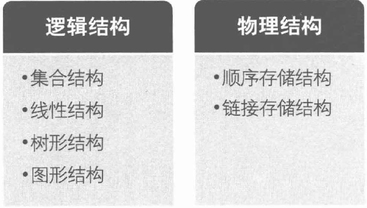

### 数据的基本概念和术语

- 数据：是描述客观事物的符号，是计算机中可以操作的对象，是能被计算机识别，并输入给计算机处理的符号集合
- 数据对象：是性质相同的数据元素的集合，是数据的子集
- 数据元素：是组成数据的、有一定意义的基本单位，在计算机中通常作为整体处理。也被称为记录。
- 数据项：一个数据元素可以由若干个数据项组成
  - 数据项是数据不可分割的最小单位

- 数据结构：是相互之间存在一种或多种特定关系的数据元素的集合

### 算法

算法定义：算法是解决特定问题求解步骤的描述，在计算机中表现为指令的有限序列，并且每条指令表示一个或多个操作。

- 算法的特性：有究性、确定性、可行性、输入、输出

- 算法的设计的要求：正确性、可该性、健壮性、高效率和低存量需求