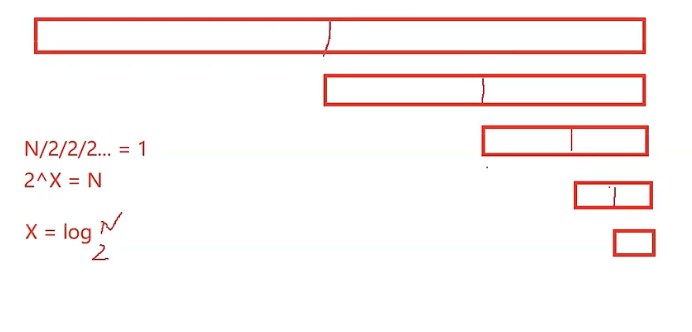
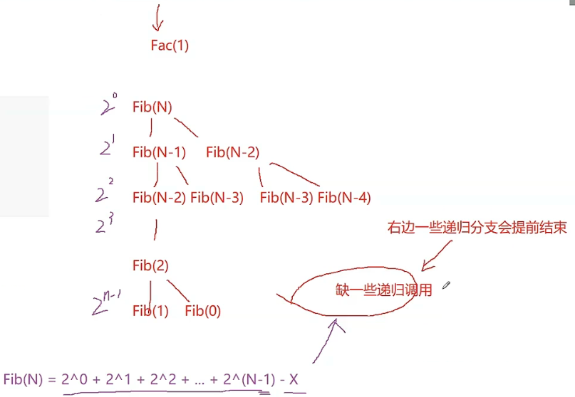
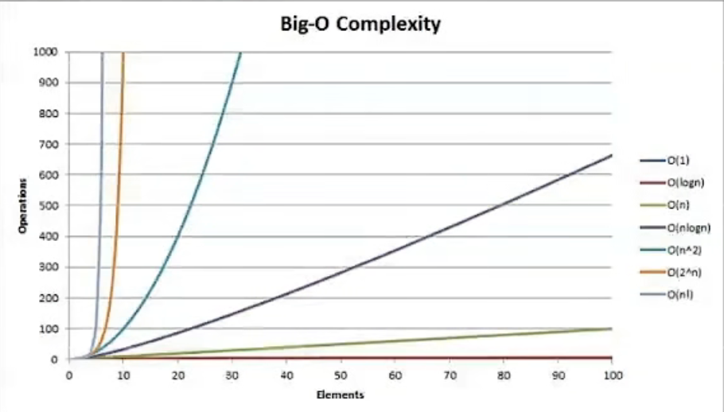

## 时间复杂度

- **时间一去不复返**，可累积

### 大 O 表示法

- 大 O 表示法是一种**估计**的大小，**摒弃次要看主要**

- **推导大 O 阶**
  - 用常数1取代运行时间中的所有加法常数
  - 在修改后的运行次数函数中，只保留最高阶项
  - 如果最高阶项存在且不是1，则去除与这个项相乘的常数

1. 冒泡排序-BubbleSort：

> n-1, n-2, n-3, ...2, 1
>
> (1 +(n-1)) * n/2 = n^2/2; O(n^2)

2.  二分查查-BinarySearch：

3. 阶乘递归算法

> N = 递归次数 * 每次递归调用的次数
>
> 递归n次，每次递归调用**常数次**
>
> N = C * n, O(N)

4. 斐波那契数列递归算法

> return Fib(N-1)+Fib(N-2);
>
> 二分树，F(N)=O(2^N)
>
> - 斐波那契数列**递归写法**实际使用因为太慢了，没什么用处，不会使用的。

## 空间复杂度

- 定义：空间复杂度是对一个算法在运行过程中**临时变量占用存储空间大小**的量度
  - 临时变量占用的**存储空间**可以在**栈区**或者**堆区**皆可

- 表达方式：**大O表示法**

- **空间**是可以重复利用，**不累积**
  - 斐波那契数列递归算法，时间复杂度O(2^n)，空间复杂度 O(N)，因为时间是可以累积的，空间是可以重复利用的

## 函数大小比较

$$O(1)<O(logn)<O(n)<O(nlogn)<O(n^2)<O(n^3)<O(2^n)<O(n!)<O(n^n)$$

