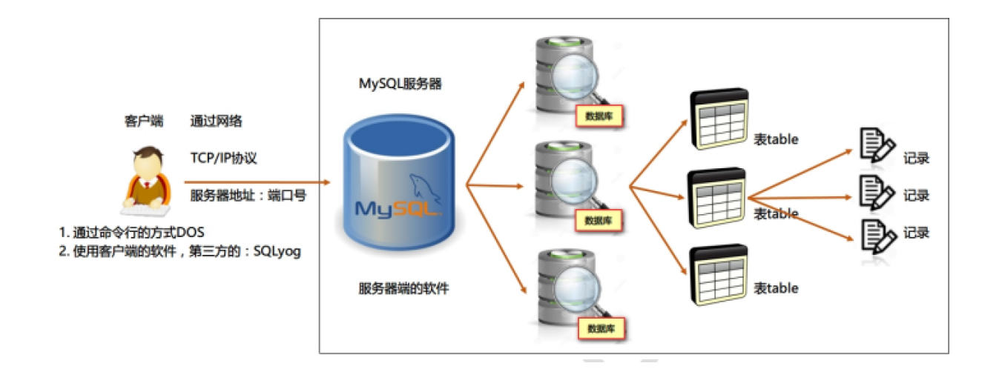

## 为什么要使用数据库
- 数据持久化
  - 把数据保存到可掉电式存储设备中以供之后使用
  - 意味着将内存中的数据保存到硬盘上加以”固化”
  - 主要作用是将内存中的数据存储在**关系型数据库**中

## 相关概念
- DB(databse) 数据库
- DBMS(database management system) 数据库管理系统
  - R(Relational)DBMS 关系型数据库管理系统
- SQL(structure query language) 结构化查询语言

## DB 与 DBMS 的关系
数据库管理系统(DBMS)可以管理多个数据库，一般开发人员会针对每一个应用创建一个数据库。为保存
应用中实体的数据，一般会在数据库创建多个表，以保存程序中实体用户的数据。

## RDBMS 关系型数据库管理系统

- 关系型数据库模型是把复杂的数据结构归结为简单的二元关系（即二维表格形式）
- 关系型数据库以行(row) 和列(column) 的形式存储数据。这一系列的行和列被称为表(table) ，一组表组成了一个库(database)
- 表与表之间的数据记录有关系(relationship)。现实世界中的各种实体以及实体之间的各种联系均用关系模型来表示
- 关系型数据库，就是建立在关系模型基础上的数据库，当前[排名](https://db-engines.com/en/ranking)靠前的有 oracle, MySQL, SQL Server

## 非关系型数据库(非RDBMS / NoSQL)

非关系型数据库，可看成传统关系型数据库的功能阉割版本，基于键值对存储数据，不需要经过SQL层的解析， 性能非常高。同时，通过减少不常用的功能，进一步提高性能

- 键值型数据库: 键值型数据库典型的使用场景是作为内存缓存。Redis 是最流行的键值型数据库
- 文档型数据库：MongoDB
- 搜索引擎数据库: ES
- 列式数据库
  - 是相对于行式存储的数据库 Oracle、MySQL、SQL Server 等都是采用的行式存储（Row-based），而列式数据库是将数据按照列存储到数据库中，这样做的好处是可以大量降低系统的I/O，适合于分布式文件系统，不足在于功能相对有限。大数据开发，典型产品：Cassandra, HBase等
- 图形数据库