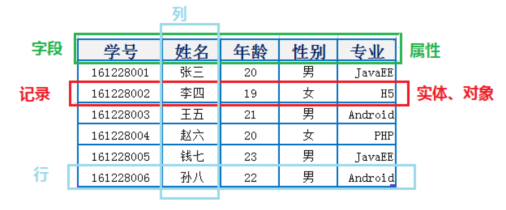
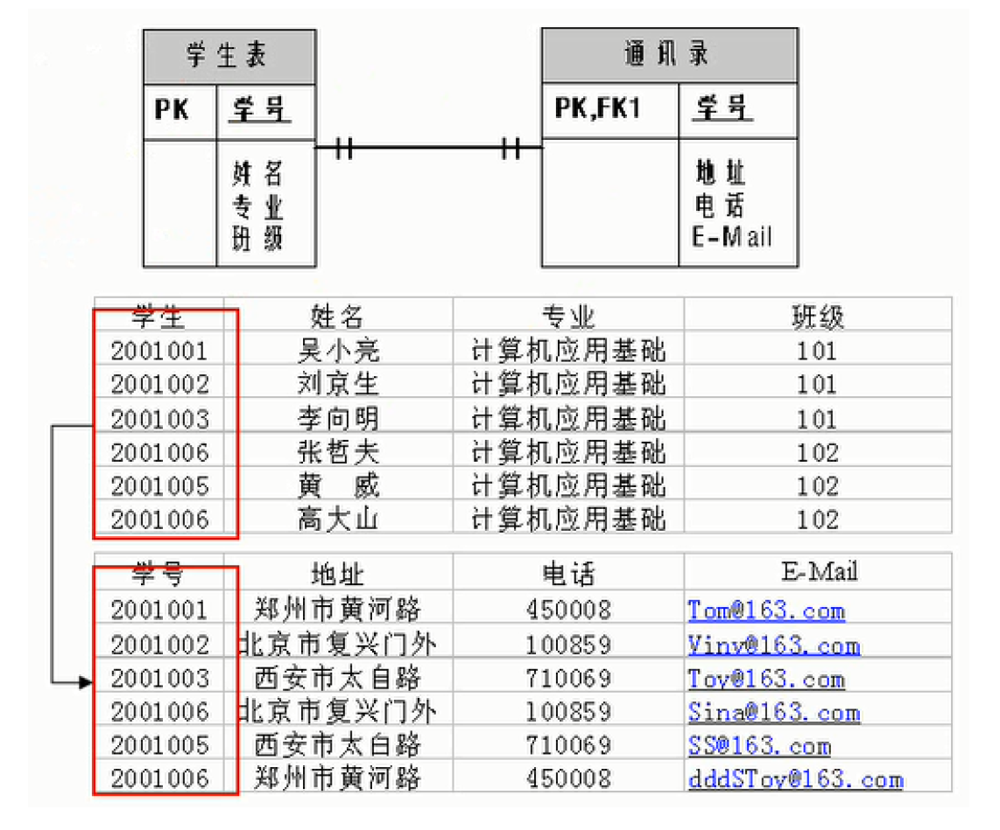
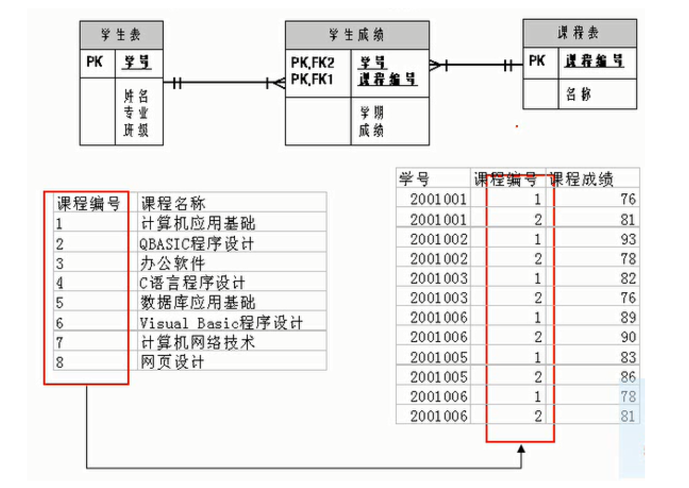
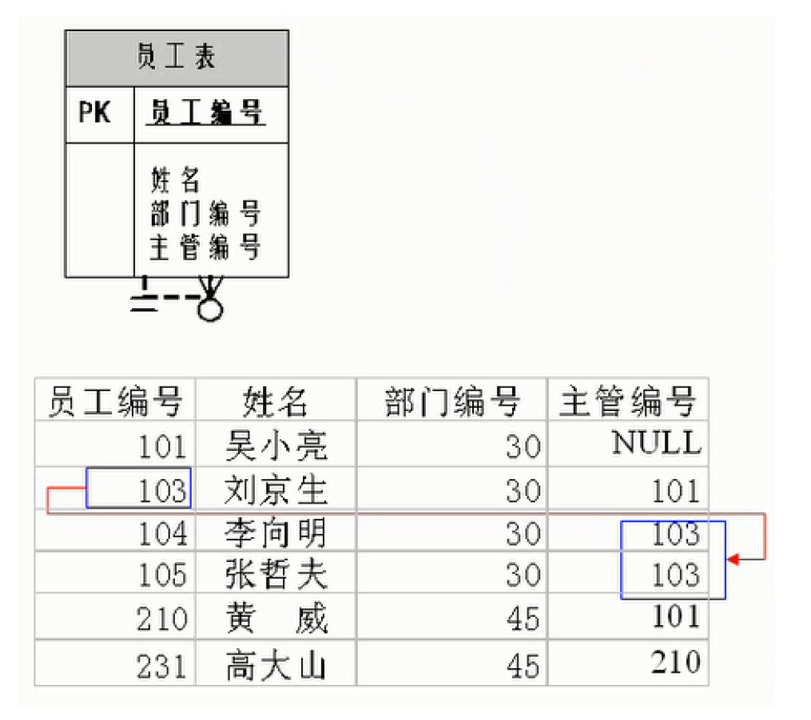

## RDBMS设计规则
- 关系型数据库的典型数据结构就是数据表，这些数据表的组成都是结构化的（Structured）
- 将数据放到表中，表再放到库中
- 一个数据库中可以有多个表，每个表都有一个名字，用来标识自己。表名具有唯一性
- 表具有一些特性，这些特性定义了数据在表中如何存储，类似 Java 和 Python 中 “类”的设计（ORM思想）

## 表、记录、字段

- E-R（entity-relationship，实体-联系）模型中有三个主要概念是： 实体集、属性、联系集
```
一个实体集（class）对应于数据库中的一个表（table）
一个实体（instance）则对应于数据库表中的一行（row），也称为一条记录（record）
一个属性（attribute）对应于数据库表中的一列（column），也称为一个字段（field）
```

- ORM 思想 (Object Relational Mapping)体现：
```
数据库中的一个表            <--->  Java或Python中的一个类
表中的一条(一般是一行)数据   <--->   类中的一个对象（或实体）
表中的一个列                <--->  类中的一个字段、属性(field)
```



## 表与表的关联关系

- 表与表之间的数据记录有关系(relationship)。现实世界中的各种实体以及实体之间的各种联系均用关系模型来表示。
- 四种：一对一关联、一对多关联、多对多关联、自我引用

### 一对一关联（one-to-one）
- 在实际的开发中应用不多，因为一对一可以创建成一张表。
- 举例：设计学生表：学号、姓名、手机号码、班级、系别、身份证号码、家庭住址、籍贯、紧急
联系人、...
  - 一个大表拆为两个表：两个表的记录是一一对应关系，通过 学号 联系起来
  - 主表，基础信息表（常用信息）：学号、姓名、手机号码、班级、系别
  - 从表，档案信息表（不常用信息）：学号、身份证号码、家庭住址、籍贯、紧急联系人、...

- 两种建表原则：
  - 外键唯一：主表的主键和从表的外键（唯一），形成主外键关系，外键唯一。
  - 外键是主键：主表的主键和从表的主键，形成主外键关系




### 一对多关系（one2many）

- 一对多建表原则：在从表(多方)创建一个字段，字段作为外键指向主表(一方)的主键



### 多对多（many-to-many）

多对多关系建表原则：必须创建第三张表作为中间表，该表通常称为联接表，中间表中至少两个字段，这两个字段分别作为外键指向各自一方的主键。

- 举例：学生-课程
  - 学生信息表：一行代表一个学生的信息（学号、姓名、手机号码、班级、系别...）
  - 课程信息表：一行代表一个课程的信息（课程编号、授课老师、简介...）
  - 选课信息表：一个学生可以选多门课，一门课可以被多个学生选择


### 自我引用(self reference)



